University English II

語 文 中 心

LANGUAGE CENTRE, HKBU
2023-2024

# University English Ii

The Language Centre, Hong Kong Baptist University Acknowledgements Course Materials Development:
Joshua Chan, John Della Pietra, Simon Wang, Louisa Wong, Emma Zhang, Paul Myers, and Ellie Law Formatting of Materials and Transcription of Videos:
Kathy Yeung ALL RIGHTS RESERVED. These materials are copyrighted. You are not permitted to make any further copy of this work, or to make it available to others. No re-sale is permitted.

Credits Although every effort has been made to contact copyright holders before publication, this has not always been possible. If noticed, the Language Centre will undertake to rectify any errors or omissions at the earliest opportunity.

Image Canva

# Table Of Contents

EXPLORING THE UNKNOWN ACADEMIC WORLD
What are the skills that are needed in academic writing? 7

6E Framework 10 What is Literature Review? 10

Example Literature Review 28

How to use the language editing book? 59 Planning for your Literature Review 62

1

| GATEWAY   | 1:   | HUMAN   | INTELLIGENCE   | IN   | THE   | FUTURE   |
|-----------|------|---------|----------------|------|-------|----------|
| WORLD     |      |         |                |      |       |          |

| 11   |
|------|

2

PAGE 3
EXPLORING THE UNKNOWN ACADEMIC WORLD
GATEWAY 2: SMART CITIES 68

| Epilogue: Choose one topic for your Literature Review   | 65   |
|---------------------------------------------------------|------|

| What is a smart city?                                     | 70   |
|-----------------------------------------------------------|------|
| In-depth Analysis - 'Social construction of technologies' | 76   |
| Example Literature Review - Industry 5.0                  | 102  |
| Planning for your Literature Review                       | 115  |

| Epilogue: Choose one topic for your Literature Review   | 118   |
|---------------------------------------------------------|-------|

PAGE 4
EXPLORING THE UNKNOWN ACADEMIC WORLD

| GATEWAY 3: DIGITAL HUMANITIES                         | 121   |
|-------------------------------------------------------|-------|
| E-visit                                               | 149   |
| Checklist for Your Writing Situation                  | 150   |
| Example Literature Review                             | 154   |
| Planning for your Literature Review                   | 166   |
| Epilogue: Choose one topic for your Literature Review | 169   |

Literature Review Part II: Your Disciplines Appendix Mastering Research: Finding Credible Journals 190

| Who am I?                                          | 173   |
|----------------------------------------------------|-------|
| Finish the Remaining Part of the Literature Review | 177   |
| Planning for the Final 400 Words                   | 178   |
| Final 400 words - Example                          | 179   |

# Unit 1 Exploring The Unknown Academic World

| What are the skills that are needed in academic writing?             | 7   |
|----------------------------------------------------------------------|-----|
| Activity 0: Discussion                                               | 7   |
| 6E Framework; What is Literature Review?                             | 10  |
| GATEWAY 1: HUMAN INTELLIGENCE IN THE FUTURE WORLD                    | 11  |
| Activity 1.1: Attitude towards academic writing                      | 12  |
| Activity 1.2: Exploring a new concept: What is transhumanism?        | 15  |
| Activity 1.3: Extracting definitions                                 | 19  |
| Activity 1.4: Evaluating attitudes and selecting cartoons            | 21  |
| Activity 1.5: Comparing Literature Reviews and Argumentative Essays  | 27  |
| Activity 1.6: Reading the example Literature Review and using the    | 28  |
| rubrics to understand it                                             |     |
| Activity 1.7: Comparing Thesis Statements and Purpose Statements     | 38  |
| Activity 1.8: Improving the writing of a paragraph                   | 40  |
| Activity 1.9: Speaking: Enchanting speaking tones                    | 42  |
| Activity 1.10: Speaking: Enunciations                                | 45  |
| Activity 1.11: Engrossing panel discussion                           | 47  |
| Activity 1.12: Experiment paraphrasing                               | 50  |
| Activity 1.13: Evaluating and chunking sentences                     | 52  |
| Activity 1.14: Listening: A conversation about bad grammar           | 56  |
| How to use the language editing book?                                | 59  |
| Activity 1.15: E-Cowriting                                           | 60  |
| Activity 1.16: Planning for your Literature Review                   | 62  |
| Activity 1.17: Epilogue: Choose one topic for your Literature Review | 65  |
| PAGE 5                                                               |     |

# University Policy On Plagiarism

Plagiarism is not tolerated at Hong Kong Baptist University 
(HKBU). Should a case of plagiarism be established, University regulations will be strictly applied. Please check https://ar.hkbu.edu.hk/quality-assurance/university-policy-andguidelines/academic-integrity for details regarding regulations. 

You should have also finished a requirement to take a plagiarism quiz in the beginning of the second semester.

You are encouraged to read the plagiarism booklet developed by HKBU Language Centre. It is available on Moodle.

You are also encouraged to visit and use the Academic Integrity and Ethics Awareness Programme (AIE-AP) developed by the Centre for Holistic Teaching and Learning at HKBU. Link: https://chtl-bu.hkbu.edu.hk/nso/AY2324-student/\#aie-ap

## Page 6

Your instructor's *name:* **________________________________________**
Section: 
Email: 

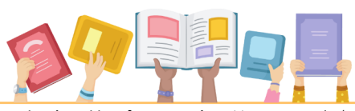

How do you feel about meeting new people, seeing a new teacher, and exploring new academic topics? Do you feel anxious or excited?

If you have the slightest feeling of any of the fears, it is better to discuss them openly and look for solutions.

| How common is                                                                                                                                                                                                                                                                                                                                                                                                                                    |           |
|--------------------------------------------------------------------------------------------------------------------------------------------------------------------------------------------------------------------------------------------------------------------------------------------------------------------------------------------------------------------------------------------------------------------------------------------------|-----------|
| My concerns                                                                                                                                                                                                                                                                                                                                                                                                                                      | Solutions |
| this concern?                                                                                                                                                                                                                                                                                                                                                                                                                                    |           |
| 1. Fear of starting a new topic 2. Fear of using unknown technology to conduct  research 3. Fear of not meeting the 'academic standards'? 4. Fear of not writing good papers and appearing  ignorant to teachers 5. Fear of not knowing the answer or finding the  information you need 6. Fear of reading long sentences, statistics and  abstract ideas 7. Fear of writing the next…and the next  sentences; it is like pulling your teeth out |           |

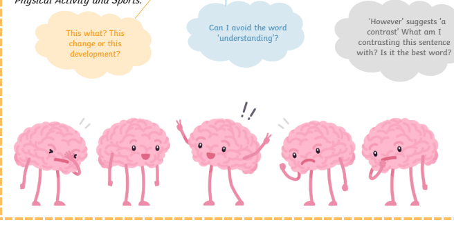

# Habits Of Mind…

Academic writing requires not only writing skills, but 

 also exploration, thinking and an audacious mindset; after that, you should feel 'I have succeeded'! The goal of this coursebook is to make you aware of the importance of conveying clear and lucid ideas that interest the reader. University English II achieves this through helping you learn about the current and evolving concepts that shape our society.

| Tasks in University  English I                   | What skills do they involve?                                |                          |                   |                              |
|--------------------------------------------------|-------------------------------------------------------------|--------------------------|-------------------|------------------------------|
| Are they transferable to University  English II? | Tasks in University  English II                             |                          |                   |                              |
| Annotated bibliography (20%)                     | -                                                           | Summarising              | -                 | Language Editing tests (20%) |
| Argumentative Essay (40%)                        | -                                                           | Paraphrasing             | -                 | Literature Review (40%)      |
| Reflective writing journal                       | -                                                           | Citation and referencing | -                 | Panel Discussion (10%)       |
| (10%) Speaking test (20%)                        | -                                                           | Thinking and speaking    | -                 | Pair Presentation (15%)      |
| -                                                | Reflecting on grammar,                                      | -                        | Library Quiz (5%) |                              |
| content, and organisation                        |                                                             |                          |                   |                              |
| -                                                | Concept learning                                            | -                        |                   |                              |
| -                                                | Advantages,  disadvantages,  counterarguments,  refutations | -                        |                   |                              |
| -                                                | Academic evaluation                                         | -                        |                   |                              |
| -                                                | Exploring the unknown                                       | -                        |                   |                              |
| concepts                                         |                                                             |                          |                   |                              |
| -                                                | Editing skills                                              | -                        |                   |                              |
| -                                                | Pronunciation and                                           | -                        |                   |                              |
| enunciation                                      |                                                             |                          |                   |                              |

Let's explore the three gateways using the 6E framework.

## Theoretical Literature Review In Ueii?

A theoretical literature review provides an *overview of* 

 current knowledge, *shares with the reader the results of* other studies, or provides a framework for *explaining the* importance of your essay or project. In University English II, a literature review is a piece of writing that allows you to examine Concepts of Change and theories, which set the context for discussing their effects on your discipline.

'Conduct your research' in this course means conducting research into Concepts of Change.

Gateway 1

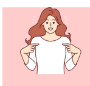

Human Intelligence in the Future World A Gateway introduces you to a series of readings, ideas and issues. This Gateway includes topics such as the nature of post-humanism, intelligence, and *cyborgs*. A significant part of university education, and what your teachers do in your department and faculty, is exploring the yet-to-be-fully-understood aspects of the world. 

Your teacher will only be able to guide you through a portion of these readings. You should not expect to receive all the explanations through the classroom activities. You may feel anxious when exploring a new topic, and we guarantee that this is normal.

Before you begin the tasks, you can FASTFORWARD to the EPILOGUE to have a glimpse at suggested writing topics.

 Attitude towards academic writing: This UEII student, Marcus, has stumbled onto 

a somewhat exciting essay topic, Transhumanism. What is this topic about?

Activity 1.1 By Frodeman (2019); Name of book: Transhumanism, Nature, and the End of Science

| Four reactions                                                   | Suggested from the course                                                                                                                                                                  |                                                                                                                                                                                  |
|------------------------------------------------------------------|--------------------------------------------------------------------------------------------------------------------------------------------------------------------------------------------|----------------------------------------------------------------------------------------------------------------------------------------------------------------------------------|
| 'Cognitive', 'Existential  state', 'of  interest', 'of  concern' | If this is your first time seeing these                                                                                                                                                    |                                                                                                                                                                                  |
| 😕 'I meet  vocabulary I  am not 100%  familiar with'            | words, then you have learned them once! - Cognitive = _____________ - Existential state = new way of  existing in the world  - 'of interest' = a post-__________ prepositional ___________ |                                                                                                                                                                                  |
| 😬 'I read a  difficult  sentence.'                              | But rather than  an aberrant  aspect 😨of  science and  technology, the  entire  architecture of                                                                                           | It is likely that others will also find it  challenging. Your feelings are not  uncommon. Analysing the sentence step  by step may help. Try the next exercise on 'rather than'. |

There are several reasons why starting a new topic causes anxiety.

| modern culture  is implicitly  transhumanist  in orientation.  😬                                                |                                                                          |                                                           |          |            |     |
|------------------------------------------------------------------------------------------------------------------|--------------------------------------------------------------------------|-----------------------------------------------------------|----------|------------|-----|
| 🤔'I cannot find  the definitions.  How can I write  my essay?' The  word definition  does not appear  anywhere. | /                                                                        | A description by the author can be seen as  a definition. |          |            |     |
| /                                                                                                                | The                                                                      | terms                                                     | 'oddball | futurists' | and |
| 😲 'I cannot  grasp the  attitude.'                                                                              | Sapere aude ('dare to know') suggest  the author's light-hearted manner. |                                                           |          |            |     |

 Look at the paragraphs above which contains multiword preposition 'rather than'. The preposition *rather than* compares two ideas, with one being more important, and is used for academic evaluation.

the entire architecture of modern culture is implicitly transhumanist in orientation.

But *rather than* an aberrant aspect of science and technology,
(Simple English: Rather than some strange scientific prediction, modern culture is moving towards transhumanism, perhaps you are just unaware of it.)

| 2                                                                   | High-tech gurus promise all    | -   | but here on earth with the   | rather than after death with   |
|---------------------------------------------------------------------|--------------------------------|-----|------------------------------|--------------------------------|
| help of technology,                                                 | the help of heavenly entities. |     |                              |                                |
| the old prizes–happiness,  peace, prosperity and even  eternal life |                                |     |                              |                                |

Select a balance to represent where the important idea is:

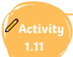

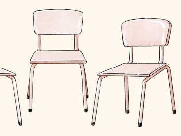

3 Living in smart homes might be much easier if we could control them with our thoughts, rather than a complicated and glitchy remote control.

Select a balance to represent where the important idea is:

12

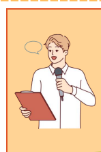

Suppose you are interested in the topic 'transhumanism' after reading the previous text, and you used ChatGPT to find out what it is. Here you have the answers. So what does ChatGPT tell you?

What are transhumanist theories in simple words?

Transhumanist theories are a set of ideas and beliefs that focus on using technology to enhance and improve human capabilities. The term
"transhumanism" refers to the idea of transcending or going beyond what is considered the normal human condition.

Transhumanists believe in the potential for technological advancements to enhance human physical and cognitive abilities. They advocate for the use of technologies like genetic engineering, artificial intelligence, and biomedical enhancements to overcome the limitations of the human body and mind.

The goal of transhumanism is to improve human life and achieve a "posthuman" state, where humans have augmented capabilities that ss increased intelligence, extended lifespans, enhanced physical strength, and even the ability to merge with machines or upload consciousness.

In simple terms, transhumanist theories are about using technology to enhance human abilities and potentially achieve a state of being that goes beyond what is currently considered "normal" for humans. 10 Like SI Dislike

What are posthumanist theories in simple words?

Posthumanist theories are a set of ideas and perspectives that challenge traditional notions of what it means to be human. They explore the ways in which technology, culture, and other factors shape our understanding of human identity and relationships with the world.

Posthumanist theories question the idea that humans are separate and ssss interconnectedness of humans with animals, nature, and even machines. These theories encourage us to reconsider the boundaries between humans and non-humans, and to think about how our identities are shaped by social and cultural influences. Posthumanism also explores the potential for new forms of existence, such as cyborgs (part-human, part-machine beings) or artificial intelligence. It raises important ethical questions about the impact of these advancements on individuals and society.

In simple terms, posthumanist theories challenge traditional views of human nature and invite us to think more broadly about what it means to be human in a rapidly changing world.

You have read ChatGPT's answers. Tell your partners what the paragraphs mean. Begin with a *prepositional phrase*, tell the reader the *sub-themes* within this topic of post-humanism within 50 words. Of fundamental interest with regard to the notion of post-humanism is the idea of AI suggests some notions for you to explore further. What are the notions you should further discover through the library's books and internet resources?

| Themes to be explored   | Name of the article   |
|-------------------------|-----------------------|

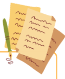

If you intend to write a Theoretical Literature Review in this area, you could focus on Cyborgs and enhanced human intelligence. Revisit the list of topics at the end of this unit.

It is very common to feel overwhelmed when searching for 

and reading academic texts. The majority of subjectdiscipline courses will require these skills in the next few years. Language Centre's consultation services can help you trudge through this challenging reading and writing process.

The *definitions of keywords* are essential when you start any Literature Review. What keywords and theories to look for depends on your interest, what literature tells you, and your intuition (vision); more importantly, your subject teachers can guide you.

you will be describing Concepts of Change. Learn this skill in this activity.

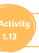

 *Extracting definitions:* In the *Literature Review Draft* and *Panel Discussion*, 
The problem is that academic writers do not always use the word 'define' when defining a concept. They use prepositional phrases, relative clauses, referring verbs, and metaphors to 

| introduce a concept. You must learn to identify them. Clue words for signalling definitions Clue 1: Someone describes something as a way of Nick Bostrom (2003), one of the key voices in the  The writer defines  it trans/posthuman academic circles, describes the  'transhuman' as a way of considering a future based on  the idea that humans still have room to evolve, using  science and technology as a catalyst (p. 4). As such, the  The writer  resulting 'posthuman' is the species that would result from  explains further this radical change, something distant from current  Transhuman humanity as apes might be to humans (p. 5). Author: McMillan (2021) Name of Book: Posthumanism in Digital Culture: Cyborgs, Gods and  Fandom., 9–55 Clue 2: An umbrella term that includes… Extended Reality or Cross Reality (XR) is an umbrella  The writer  defines it term that includes a series of immersive technologies;  electronic, digital environments where data are  Cross Reality (XR) represented and projected. XR includes Virtual Reality  (VR), Augmented Reality (AR) and Mixed Reality (MR)  (Chuah, 2018). In all the above-mentioned XR facets,  The writer humans observe and interact in a fully or partially  makes a generalisation Immersive synthetic digital environment constructed by technology.   |
|-------------------------------------------------------------------------------------------------------------------------------------------------------------------------------------------------------------------------------------------------------------------------------------------------------------------------------------------------------------------------------------------------------------------------------------------------------------------------------------------------------------------------------------------------------------------------------------------------------------------------------------------------------------------------------------------------------------------------------------------------------------------------------------------------------------------------------------------------------------------------------------------------------------------------------------------------------------------------------------------------------------------------------------------------------------------------------------------------------------------------------------------------------------------------------------------------------------------------------------------------------------------------------------------------------------------------------------------------|

Authors: Maddikunta et al. (2022)
Name of Article: Industry 5.0: A survey on enabling technologies and potential applications

Reality (AR)

| Clue 3: is the concept that mimic (looks like) something                                                                                                                                                                |                                                           |                                                            |
|-------------------------------------------------------------------------------------------------------------------------------------------------------------------------------------------------------------------------|-----------------------------------------------------------|------------------------------------------------------------|
| The writer uses                                                                                                                                                                                                         | One example for this use of deep machine learning is the  |                                                            |
| a comparison                                                                                                                                                                                                            | concept of evolutionary algorithms that mimic the process |                                                            |
| to define a                                                                                                                                                                                                             | of biological natural selection to solve hard problems    |                                                            |
| term                                                                                                                                                                                                                    | through a series of mutations and crossovers into new     | Evolutionary  algorithms =  algorithms that  keep evolving |
| forms, with the best form the one that survives and solves  the problem (Soni 2018). Author: Creely (2022) Name of Article: Conceiving Creativity and Learning in a World of  Artificial Intelligence: A Thinking Model |                                                           |                                                            |

How to describe concepts in a literature review:
or 'proposition' (=a claim).

1. Label the ___________________ using 'quotation marks' or words like 'the term' or 'concept', 
2. Use relative clauses, e.g., a concept that includes / that mimics… 3. Use your own words to explain it further. We have more examples in the next two units.

 *Evaluating attitudes and selecting cartoons:* Select the cartoon that 

represents the attitude of the author(s), then practise generalisation.

Academic writing can include various styles and may not always be argumentative in nature. However, it is almost certain that all writers will somewhat express their attitudes through their writings. Find the subtleties of these attitudes by *selecting a cartoon*. Discuss with your classmates how the attitude is expressed in these excerpts. 

| Select the cartoon that represents the  author's attitude                                                                                                                                                                                                                                                                                                                      | Key ideas                                 |         |    |        |       |
|--------------------------------------------------------------------------------------------------------------------------------------------------------------------------------------------------------------------------------------------------------------------------------------------------------------------------------------------------------------------------------|-------------------------------------------|---------|----|--------|-------|
| Find a rhetorical                                                                                                                                                                                                                                                                                                                                                              |                                           |         |    |        |       |
| Some                                                                                                                                                                                                                                                                                                                                                                           | economists                                | predict | a  | future | where |
| unenhanced humans will be completely useless.  While robots and 3D printers replace workers in  manual jobs such as manufacturing shirts,  intelligent algorithms will threaten white-collar  jobs. Bank clerks and travel agents have become  endangered species. How many travel agents do we  need when we can use our smartphones to buy  plane tickets from an algorithm? | question: Find two  metaphors: Algorithms |         |    |        |       |
| Author: Harari (2015) Name of book: Homo deus: A brief history of tomorrow                                                                                                                                                                                                                                                                                                     | endangered  species                       |         |    |        |       |
| ï‚£ Writing strategies:  The use of strong verbs (e.g., threaten, replace) The contrast clause (e.g., While) The questioning tone Adjectives and adverbs (e.g., completely useless, unenhanced human)  All of these convey the writer's attitude.                                                                                                                                |                                           |         |    |        |       |

This chapter offers a social, 

political, and aesthetic critique of transhumanism and of the accelerating growth of scientific knowledge generally. Rather than improving our lives, science and technology today increasingly leave us debilitated and infantilised. It is time to restrain the runaway ambitions of technoscientific knowledge.

Frodeman 2019 Debilitated and infantilised Author: Frodeman (2019) Name of book: Transhumanism, Nature, and the End of Science Generalise the meaning of this paragraph. Put the citation at the back.

Research has expressed concerns regarding __________________________________________________________________________________
The term 'cyborg' has traditionally meant 'a 

 coupling between a human being and an electronic or mechanical apparatus,' or 'the identity of organisms embedded in a cybernetic information system" (Balsamo, 1996, p. 11). The idea of a 'cyborg' replaces the traditional views by Descartes about mind and body separation (Muri, 2007, p. 6). 

Technology blurs this distinction by integrating with both our physical bodies and our thinking processes. One example is the field of neuromorphic computing.

mind and body 

separation
(This notion does not imply that we are spirits capable of leaving our bodies)

Neuromorphic

Authors: Michael et al. (2023)
Name of Chapter: Cyborgs and Human–Machine communication configurations. 

| 'Is one of…' is a                                                                                                                                                                                                                                                                                                                                                                                                                                                                                                                                                                                                                         |                                      |
|-------------------------------------------------------------------------------------------------------------------------------------------------------------------------------------------------------------------------------------------------------------------------------------------------------------------------------------------------------------------------------------------------------------------------------------------------------------------------------------------------------------------------------------------------------------------------------------------------------------------------------------------|--------------------------------------|
| Generalise the meaning and attitude of this paragraph using 'is one of…'.                                                                                                                                                                                                                                                                                                                                                                                                                                                                                                                                                                 | common                               |
| Put the citation at the beginning.                                                                                                                                                                                                                                                                                                                                                                                                                                                                                                                                                                                                        | evaluative  phrase. It               |
| Michael et al.'s (2023) attitude is one of  ____________________________________________________________________                                                                                                                                                                                                                                                                                                                                                                                                                                                                                                                          | suggests that  among the             |
| ____________________________________________________________________                                                                                                                                                                                                                                                                                                                                                                                                                                                                                                                                                                      | various attitudes  the writers in    |
| ____________________________________________________________________                                                                                                                                                                                                                                                                                                                                                                                                                                                                                                                                                                      | the field have,  his show traces     |
| ____________________________________________________________________                                                                                                                                                                                                                                                                                                                                                                                                                                                                                                                                                                      | of a certain  attitude.              |
| While medical implants improve innate capabilities  to overcome illnesses, non-medical implants also  enhance innate capabilities, but they do not aim to  cure medical problems. Importantly, both types of  implants do not change a person's mental state,  consciousness, or perception; they simply boost  their inherent capabilities (Park 2014; Lai 2012;  Buchanan-Oliver and Cruz 2011; Christie and  Bloustien 2010). This raises a crucial question of  whether the cyborg evolution might redefine our  understanding of human medical anomalies and  therefore reshape drastically our societal norms of  human boundaries. | medical  implants Medical  anomalies |
| Ireni-Saban & Sherman (2021) Name of Article: Cyborg ethics and regulation: ethical issues of  human enhancement                                                                                                                                                                                                                                                                                                                                                                                                                                                                                                                          |                                      |

Generalise the meaning and attitude of this paragraph using *'is one of…'*. Ireni-Saban and Sherman's (2023) attitude towards performing medical implants is one of ___________________________________________________________________________________
As a result, the technological revolution of artificial 

intelligence (AI) and cyborgs transforms the human body into an information processing technology and turns it more computational and informatised. 

This revolution undermines the absolute human identity and enabling the vision of hybrid creatures, consisting of human and technological components at one.

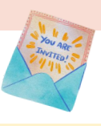

Human identity Authors: Ireni-Saban & Sherman (2021)

Name of Article: Cyborg ethics and regulation: ethical issues of human enhancement Generalise the meaning and attitude of this paragraph using 'are *of the opinion that*' The authors, Ireni-Saban and Sherman (2023), are of the opinion that

optimistic Some well-known scientists worry about robots replacing humans, potentially causing massive unemployment. However, these concerns overlook the potential for humans to become superior cyborgs through body-enhancing technologies. 

Cyborgs could include individuals with massproduced implants, body hacks, or custom insideables.

Author: Fox (2018) Name of Article: Cyborgs, Robots and Society: Implications for the Future of Society from Human Enhancement with In-The-Body Technologies.

Insideables =
devices implanted in the human body

| Generalise the meaning and attitude of this paragraph using the verbs 'acknowledge' and  'question'. Fox (_______) acknowledges that ___________________________________________________________________________________ ___________________________________________________________________________________ ___________________________________________________________________________________ ___________________________________________________________________________________   |
|----------------------------------------------------------------------------------------------------------------------------------------------------------------------------------------------------------------------------------------------------------------------------------------------------------------------------------------------------------------------------------------------------------------------------------------------------------------------------------------|

| What have you learned about expressing attitudes? Ask questions Use words 'critique', 'question'   | Use evaluative words                                                         |                             |
|----------------------------------------------------------------------------------------------------|------------------------------------------------------------------------------|-----------------------------|
| and 'concern'                                                                                      |                                                                              |                             |
| How many travel agents do                                                                          | leave us debilitated and                                                     |                             |
| we need when…                                                                                      | This essay offers a critique of                                              | infantilised (=like babies) |
| This raises a crucial question                                                                     | turns it more computational                                                  |                             |
| of whether                                                                                         | and informatised                                                             |                             |
| There have been concerns  about                                                                    |                                                                              |                             |
| Use It's time to                                                                                   | Use discourse organisers                                                     | Use adverbs to evaluate     |
| It is time to recast our                                                                           | While…but they do not aim                                                    | Importantly…                |
| understanding of intelligence                                                                      | to…                                                                          | More generally…             |
| Guide the reader through                                                                           | Increasingly                                                                 |                             |
| comparing ideas within the                                                                         | reshape drastically                                                          |                             |
| argument.                                                                                          | Discover it with                                                             |                             |
| Use strong and concrete verbs                                                                      | Defend your position                                                         | your teacher                |
| Undermines the human identity Transforms the human body Technology blurs this distinction          | Yet, such concerns do not take  into account the potential for  human beings |                             |

If you feel lost when reading the academic concepts, it is probably 

 natural. UEII sets everyone on a path of discovery of unknown that lies ahead in the future. 

'Cyborgs' are an interesting topic to explore. You may choose this as your Literature Review topic and write about it in your Literature Review Draft. Try Google Scholar in class or at home: https://scholar.google.com/
 *Comparing Literature Reviews and Argumentative Essays:* This 

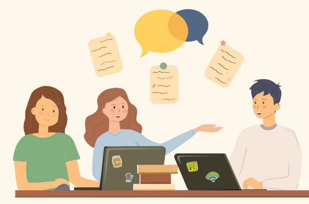

literature review introduces the notion that *AI is not the same as real* intelligence as we usually understand it.

Activity 1.5 The main purpose of this literature review is to demonstrate his understanding of 

 intelligence and its related controversies.

1. Since this writer *does not try to make any definitive arguments*, which one is a more suitable title for this literature review? 

 The benefits and drawbacks of artificial intelligence

 Controversies around artificial intelligence: Some basic issues 

 A reflection on the differences between artificial and human intelligence

2. Compare this *Theoretical Literature Review* with an *Argumentative Essay* you 

| wrote in UEI. Explain why you selected such ratings.          |                  |    |    |    |    |                                    |
|---------------------------------------------------------------|------------------|----|----|----|----|------------------------------------|
| They have the same                                            | 1                | 2  | 3  | 4  | 5  | Not really                         |
| structure Arguments and  counterarguments                     | 1                | 2  | 3  | 4  | 5  | Not really                         |
| should be included in  the literature review Writer's opinion | Writer's opinion |    |    |    |    |                                    |
| should be included in                                         | should not be    |    |    |    |    |                                    |
| the Literature Review                                         | 1                | 2  | 3  | 4  | 5  | included in the  Literature Review |
| The aim of this                                               | The aim of this  |    |    |    |    |                                    |
| literature is to                                              | literature is to |    |    |    |    |                                    |
| increase readers'                                             | 1                | 2  | 3  | 4  | 5  | identify                           |
| understanding of                                              | advantages and   |    |    |    |    |                                    |
| concepts                                                      | disadvantages    |    |    |    |    |                                    |

 Let's read the example literature review and use the rubrics to understand it.

Activity 1.6 The purpose of this Literature review is to discuss the controversies surrounding Artificial Intelligence (AI) and it concludes with the author's opinions. AI is becoming a buzzword in many contexts around the world, in particular, in schools and higher institutions, where teaching and learning are increasingly digitized (Dator, 2020; Köstler & Ossewaarde, 2021). At the same time, the question of how AI intertwines with creativity is emerging (e.g., Rust & Huang, 2021). Here is a brief introduction to the background according to my review.

| Vocabulary                 | Flow   |
|----------------------------|--------|
| General purpose  statement |        |
| controversies              |        |

The field of AI has evolved from a small research project at Dartmouth College (US) in the 1950s to recent advances. As Creely (2022) outlined, AI has been applied to a dozen industries, including big data analytics, speech and facial recognition (e.g., Siri), and robotics, among others. Advances in machine learning and deep learning have facilitated AI's creative contributions to all aspects of life (Boden, 2018; Mitchell, 2019; Verma et al., 2021; Yi & Loia, 2019). However, neither being new nor effective alone is sufficient for AI to be referred to as intelligent. A compelling example is given by Cropley et al. (2022, p. 22), who illustrate this with an example: solving a parking issue by parking on the moon is novel but impractical. A creative product is novel, effective, and based on one's understanding of the world. According to Cropley et al., a product is creative when it is both novel and effective, and design must be based on one's knowledge of the world and sensibilities.

Parking on the 

moon

| Intertwines   |
|---------------|

Sensibilities

| Discourse  organiser   |
|------------------------|

| data analytics   |
|------------------|

| Robotics   |
|------------|

| Overall   |
|-----------|
| landscape |

| Backtracking/ History   |
|-------------------------|

| General  examples   |
|---------------------|

| Interesting  example   |
|------------------------|

## Controversies Surrounding Artificial Intelligence

AI approaches, while innovative, are not exempt from ethical controversies. At the heart of these arguments lies a critical question - will super AI systems ever take over human intelligence (Peeters et al., 2021). I would like to introduce two prominent threads that underlie this debate. The first paragraph discusses the human-centric perspective of intelligence and creativity, and the next paragraph focuses on how AI creativity overturns our conception of consciousness. The first is about using the term 'intelligence' which is often used to frame the scope of AI innovation. In general, intelligence is the ability to successfully engage in the world, adapt to new situations, and solve theoretical and practical problems (Schlinger, 2003; Staats & Burns, 1981). There are three types of intelligence, according to Sternberg et al (2008): analytical, practical, and creative. Sternberg's theory emphasizes that intelligence is made up of humans' ability to perceive the world through senses and sensibilities. However, with AI, there is an underlying assumption that creativity is limited to computation and less emphasis on touchy perception. This view results in a narrow conception of creativity. The idea of AI creativity is challenged when the notion of consciousness comes into the picture. Consciousness, a topic debated across many disciplines, including brain science, and even ancient philosophers (Sattin et al., 2021), is hard to define or understand, despite its being present in biological beings, and particularly humans with larger brains (Shear, 1997). The aim of AI, particularly strong or super AI, is to create an independent, non-biological intelligence that incorporates consciousness. However, achieving this, especially without a clear understanding or agreed definition of consciousness, seems quite difficult (Li et al., 2021). The literature reviewed questions what remains of intelligence when it is intelligence without consciousness.

Human-centric 

perspective Generalising

world

Touchy 

perception

Problematising
(Pointing out the problem)

intelligence

Consciousness

## Yet, More Problems Are Waiting To Be Solved

An important quote from Harari (2017, p. 251) states: 
"Until today, high intelligence always went hand in hand with a developed consciousness. Only conscious beings could perform tasks that required a lot of intelligence".

Autonomous Contrasting

Purpose Statement Please end in 

this way in your literature review draft.

(726 words)
Finally, let's imagine that you are reviewing this literature review and you want to use an evaluative adjective to describe the work. Mark with a tick the adjectives that best describe your evaluation of this work.

| Impressive   | Informative   | Nice        |
|--------------|---------------|-------------|
| Useful       | Worthwhile    | Outstanding |
| Interesting  | Respectable   | Unusual     |
| Painstaking  | Laudable      | Practical   |

Adapted from Creely Creely, E. (2022). Conceiving creativity and learning in a world of artificial intelligence: A thinking model. In D. 

Henriksen & P. Mishra (Eds.), Creative provocations: Speculations on the future of creativity, technology & 
learning (pp. 35-50). Springer. https://doi.org/10.1007/978-3-031-14549-0 This perspective is at odds with the new definitions of "creativity" and "consciousness" outlined above that AI creativity underpins. According to Tegmark (2017), this is Life 3.0, where non-biological intelligent life can think, create and be fully autonomous, existing on an equivalent level with biological life. By revisiting these notions, my literature review has led to a better understanding of how AI intelligence differs from our traditional understanding of intelligence. However, there is also a risk of disruption to what is considered to be a 'normal' learning process: As AI becomes more humanlike, teachers' role in influencing student creativity may shift as the machine becomes creative (see, Creely, 2022), and this could subvert the usual role of a teacher.

The next part of this review will move onto how intelligent machines impact my research area, Physical Activity and Sports.

Using the rubrics to understand the Literature Review

Since a real literature review is not an assignment, it is not normally graded. Nevertheless, we will apply the Literature review draft assessment rubrics (Full mark: 100; A: 85/100) and understand how they function. In the following, use different parts of the rubrics to evaluate each paragraph.

Discuss with your classmates the effectiveness of each paragraph.

| Improvements          | Close to                                        | Above and          |                       |               |                   |       |
|-----------------------|-------------------------------------------------|--------------------|-----------------------|---------------|-------------------|-------|
| Fail                  | Marginal                                        | Satisfactory       |                       |               |                   |       |
| needed                | Excellence                                      | By on complete and |                       |               |                   |       |
| 4 or                  | D, C-                                           | B-, B              |                       |               |                   |       |
| C, C+                 | R                                               | A- to A            |                       |               |                   |       |
| below                 | 45-54.5                                         | 65-74.5            |                       |               |                   |       |
| 55-64.5               | 80- Above                                       |                    |                       |               |                   |       |
| 75                    |                                                 |                    |                       |               |                   |       |
| PART 1                | - Theoretical Literature Review Draft 800 words |                    |                       |               |                   |       |
| Non-                  | Aims and scope of                               | Aim and scope of   | Aim and scope of      | Aim and scope |                   |       |
| Amore and the stat    |                                                 |                    |                       |               |                   |       |
| submission            | the literature review                           | the literature     | the literature review | scope of the  | of the literature |       |
| are barely stated     | review are                                      | are identified     | review are both       |               |                   |       |
| Off-topic             | Weak gap or                                     | somewhat unclear   | Writer provides a     | review are    | clear and         |       |
| problem statement     | Writer hints at                                 | clearly            | focused               |               |                   |       |
| Oher                  | moderately                                      | Writer provides    |                       |               |                   |       |
| serious               | reason/gap for                                  | effective          | Identified            |               |                   |       |
| weaknesse             | literature review                               | explanation of why | Writer                | a highly      |                   |       |
| effective             |                                                 |                    |                       |               |                   |       |
| the literature/review |                                                 |                    |                       |               |                   |       |
| express it fully      | cherent                                         |                    |                       |               |                   |       |
| is needed,            | Justification of                                |                    |                       |               |                   |       |
| explanation           | reason/gap for                                  |                    |                       |               |                   |       |
| of why the            | literature review.                              |                    |                       |               |                   |       |
| literature            |                                                 |                    |                       |               |                   |       |
| neded.                |                                                 |                    |                       |               |                   |       |
| 10                    | 13.5                                            | 14                 | 15.5                  | 16            | 16.5              | 17-18 |

The purpose of this Literature review discuss the is to controversies surrounding Artificial Intelligence (ÃI) and it concludes with the author's opinions.

AI is becoming a buzzword in many contexts arofind the world, in particular, in schools and higher institutions/where teaching and learning are increasingly digitized (Dator, 2020; Köstler & Ossewaarde, 2021). At the same time, the question of how AI intertwines with creativity is emerging (e.g., Rust & Huang, 2021). Here is a brief introduction to the background according to my review.

## Teacher'S Comment:

As a reader, I am informed of the purpose.     Also,    
 I
aree that AI is becoming a buzzword. This idea resonates with mine.

The field of AI has evolved from a small research project at Dartmouth College (US) in the 1950s to recent advances. As Creely (2022) outlined, AI has been applied to a dozen industries, including big data analytics, speech and facial recognition (e.g., Siri), and robotics, among others. Advances in machine learning and deep learning have facilitated AI's creative contributions to all aspects of life (Boden, 2018; Mitchell, 2019; Verma et al., 20/21; Yi & Loia, 2019). However, neither being new nor effective alone is sufficient for AI to be referred to as intelligent. A compelling example is given by Cropley et al. (2022, p. 22), who illustrate this with an example: solving a parking issue by parking on the moon is novel but impractical. A creative product is novel, effective, and based on one's understanding of the world. According to Cropley et al., a product is creative when it is both novel and effective, and design must be based on one's knowledge of the world and snsibilities.

Teacher's comment:
The generalisations and examples help me understand AI
as a field. 

 As readers, we learn something new as we read on.

Teacher's comment:
As readers, we feel that there ademic evaluation of the readings.  Adjectives and     coordinating conjunctions
'neither…nor' indicate       attitude and critical thinking.       Jargon terms are explained through an interesting example.

CONTENT
(includes)
Academic Evaluation)
(20%)
3 1.5 12 12.5 13.5

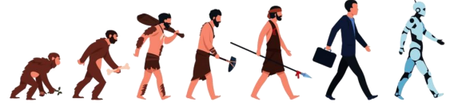

| Themes are        |
|-------------------|
| poorly organised  |
| and do not follow |
| a logical         |
| progression       |
| Digressions and   |
| disjointed        |
| discussions       |

| Themes are          |
|---------------------|
| structured in a     |
| satisfactory        |
| manner.             |
| progressing from    |
| general to specific |
| and from one point. |
| to the next.        |

(hemes are

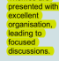

16 17-18 Teacher's comment:

## Controversies Surrounding Artificial Intelligence,

AI approaches, while innovative, are not exempt from ethical controversies. At the heart of these arguments lies a critical question –
will super AI systems ever take over human intelligence (Peeters et al., 21). I would like to introduce two prominent threads that underlie this debate. The first paragraph discusses the human-centric perspective of intelligence and creativity, and the next paragraph focuses on how AI creativity overturns our conception of consciousness.

use The The of subheadings introduces themes focuses and discussion.

The writer presents his arguments in a way that leads us to understand       
the literature a systematic way.

| Some issues      | Grammar and word    |      |
|------------------|---------------------|------|
| related to       | use are moderately  |      |
| grammar,         | effective and       |      |
| sentence         | appropriate         |      |
| structure, and   | Some complex        |      |
| word use that    | sentence structures |      |
| impede           | Mistakes do not     |      |
| comprehension to | impede              |      |
| some extent      | comprehension       |      |
| 1.5              | 12                  | 12.5 |

Teacher's comment:
The first is about using the term 'intelligence' which is often used to frame the scope of AI innovation. In general, intelligence is the ability to successfully engage in the world, adapt to new situations, and solve theoretical and practical problems
(Schlinger, 2003; Staats & Burns, 1981). There are three types of intelligence, according to Sternberg et al. (2008): analytical, practical, and creative. Sternberg's theory emphasizes that intelligence is made up of humans' ability to perceive the world through senses and sensibilities. However, with AI, there is an underlying assumption that creativity is limited to computation and less emphasis on touchy perception. This view results in a nrrow conception of creativity.

The first 'what'? A bit unclear here. In general, the writer uses adjectives, nns, and noun phrases carefully.

There are a variety of sentence structures: declarative clauses (here is/are),

| Themes not            |
|-----------------------|
| Unplanned or          |
| erratic flow of logic |
| Generally             |
| incoherent            |

complex, embedded sentences (while) and parallel structures (to engage...adapt...

solve).

## Your Turn:

Now is the time for you to evaluate these paragraphs using

the assessment rubrics. Read the rubrics and each paragraph. Give a mark to it.

CONTENT
(Includes Academic Evaluation)
(20%)

| Explanations are     | Explanations are   | Explanations are   | Explanations   | Concepts are    |       |    |    |      |    |      |
|----------------------|--------------------|--------------------|----------------|-----------------|-------|----|----|------|----|------|
| highly irrelevant    | somewhat           | moderately         | dsplays a      | explained in    |       |    |    |      |    |      |
| and/or vague         | irrelevant and/or  | relevant and clear | high level of  | context and to  |       |    |    |      |    |      |
| Minimal content      | vague              | Information is     | clarity and    | adequate depth  |       |    |    |      |    |      |
| provided             | Superficial,       | presented but not  | cherence       | of detail       |       |    |    |      |    |      |
| Lacking evaluation   | unresearched       | entirely unpacked  | Makes effort   | Explains jargon |       |    |    |      |    |      |
| and generalisation   | content;           | for readers        | to explain     | with great      |       |    |    |      |    |      |
| of information       | Information is not | A moderate ability | accuracy to    |                 |       |    |    |      |    |      |
| jargon to            |                    |                    |                |                 |       |    |    |      |    |      |
| upacked for          | to evaluate and    | demonstrate        | demonstrate    |                 |       |    |    |      |    |      |
| readers              | gneralise          | reader             | reader         |                 |       |    |    |      |    |      |
| A weak ability to    | awareness          |                    |                |                 |       |    |    |      |    |      |
| information          | awareness          |                    |                |                 |       |    |    |      |    |      |
| evaluate and         | Quite              | Strong ability to  |                |                 |       |    |    |      |    |      |
| generalise           | effective          | evaluate and       |                |                 |       |    |    |      |    |      |
| information          | evaluation         | generalise         |                |                 |       |    |    |      |    |      |
| information          |                    |                    |                |                 |       |    |    |      |    |      |
| and                  |                    |                    |                |                 |       |    |    |      |    |      |
| generalisation       |                    |                    |                |                 |       |    |    |      |    |      |
| n of                 |                    |                    |                |                 |       |    |    |      |    |      |
| information          |                    |                    |                |                 |       |    |    |      |    |      |
| Reader struggles to  | Reader             | Reader             | Reader         | Reader feels    |       |    |    |      |    |      |
| uderstand the        | understands 30-    | uderstands 50-     | understands    | they learnt     |       |    |    |      |    |      |
| something new        |                    |                    |                |                 |       |    |    |      |    |      |
| content all the time | 50%                | 70%                | 70-80%         |                 |       |    |    |      |    |      |
| 10                   | 1.5                | 13.5               | 16             | 16.5            | 17-18 |    |    |      |    |      |
| g                    | 9.5                | 10.5               | 11             | 12              | 12.5  | 13 | 14 | 14.5 | 15 | 15.5 |

What is your comment?

The idea of AI creativity is challenged when the notion of consciousness comes into the picture. Consciousness, a topic debated across many disciplines, including brain science, and even ancient philosophers (Sattin et al., 2021), is hard to define or understand, despite its being present in biological beings, and particularly humans with larger brains (Shear, 1997). The aim of AI, particularly strong or super AI, is to create an independent, non-biological intelligence that incorporates consciousness. However, achieving this, especially without a clear understanding or agreed definition of consciousness, seems quite difficult (Li et al., 2021). The literature reviewed questions what remains of intelligence when it is intelligence without consciousness.

6

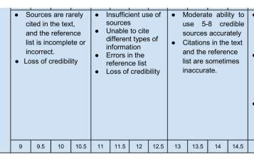

| Excellent ability   |    |     |
|---------------------|----|-----|
| to cite different   |    |     |
| types               |    |     |
| information         |    |     |
| different citation  |    |     |
| formats             |    |     |
| Highly effective    |    |     |
| use                 | of | 4-8 |
| sources.            |    |     |

| 17-18   |      |
|---------|------|
| 16      | 16.5 |

What is your comment?

## Yet, More Problems Are Waiting To Be Solved

An important quote from Harari (2017, p. 251) states:
"Until today, high intelligence always went hand in hand with a developed consciousness. Only conscious beings could perform tasks that required a lot of intelligence".

This perspective is at odds with the new definitions of
"creativity" and "consciousness" outlined above that AI
creativity underpins. According to Tegmark (2017), this is Life 3.0, where non-biological intelligent life can think, create and be fully autonomous, existing on an equivalent level with biological life.

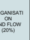

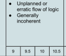

| Themes not            | Themes are         | Themes are          | Themes        |      |    |      |    |      |    |      |    |      |
|-----------------------|--------------------|---------------------|---------------|------|----|------|----|------|----|------|----|------|
| identified            | poorly organised   | structured in a     | exhibit an    |      |    |      |    |      |    |      |    |      |
| Unplanned or          | and do not follow  | satisfactory        | avanced       |      |    |      |    |      |    |      |    |      |
| erratic flow of logic | a logical          | manner,             | level of      |      |    |      |    |      |    |      |    |      |
| Generally             | progression        | progressing from    | organization; |      |    |      |    |      |    |      |    |      |
| incoherent            | Digressions and    | general to specific | they are      |      |    |      |    |      |    |      |    |      |
| disjointed            | and from one point | effectively         |               |      |    |      |    |      |    |      |    |      |
| discussions           | to the next.       | introduced          |               |      |    |      |    |      |    |      |    |      |
| 9.5                   | 10                 | 10.5                | 1             | 11.5 | 12 | 12.5 | 13 | 13.5 | 14 | 14.5 | 15 | 15.5 |

| Themes are     |
|----------------|
| presented with |
| excellent      |
| organisation,  |
| leading to     |
| focused        |
| discussions.   |

17-18 16

| 16.5   |
|--------|

What is your comment?

8 By revisiting these notions, my literature review has led to a better understanding of how AI intelligence differs from our traditional understanding of intelligence. However, there is also a risk of disruption to what is considered to be a 'normal' learning process: As AI becomes more human-like, teachers' role in influencing student creativity may shift as the machine becomes creative (see, Creely, 2022), and this could subvert the usual role of a teacher.

The next part of this review will move onto how intelligent machines impact my research area, Physical Activity and Sports.

Overall, does this literature deserve bonus marks?

| MACRO      | Nuanced understanding of the topic / theories at the text level; the work resembles an authentic literature review.   |                                                                                              |
|------------|-----------------------------------------------------------------------------------------------------------------------|----------------------------------------------------------------------------------------------|
| +3         |                                                                                                                       |                                                                                              |
| ORGANISATI |                                                                                                                       |                                                                                              |
| ONAL       | +2                                                                                                                    | Proper framing through selecting and sequencing information, and highlighting of information |
| STRATEGY   | 0                                                                                                                     | No evident macro-organisational strategy use                                                 |

| What do we learn from this literature review? Use discourse organisers Show your understanding                                                                             | Show your evaluation                                                                                   |                                                                |                       |
|----------------------------------------------------------------------------------------------------------------------------------------------------------------------------|--------------------------------------------------------------------------------------------------------|----------------------------------------------------------------|-----------------------|
| to manage the flow of the  discussion                                                                                                                                      | The literature reviewed                                                                                |                                                                |                       |
| -                                                                                                                                                                          | The question of [something] is  emerging                                                               |                                                                |                       |
| -                                                                                                                                                                          | The field of [something] has  evolved                                                                  |                                                                |                       |
| -                                                                                                                                                                          | In general                                                                                             |                                                                |                       |
| -                                                                                                                                                                          | However, with AI, there is an  underlying assumption that                                              |                                                                |                       |
| -                                                                                                                                                                          | …this could subvert the usual  role of a teacher                                                       | questions what remains of                                      |                       |
| -                                                                                                                                                                          | The purpose of this literature  review                                                                 |                                                                |                       |
| -                                                                                                                                                                          | in particular                                                                                          |                                                                |                       |
| -                                                                                                                                                                          | At the same time                                                                                       |                                                                |                       |
| -                                                                                                                                                                          | I would like to introduce two  prominent threads…                                                      |                                                                |                       |
| -                                                                                                                                                                          | By revisiting these notions, my  literature review has led to                                          | intelligence when it is  'intelligence without  consciousness' |                       |
| Use topic sentences                                                                                                                                                        | Show the reader the 'point'                                                                            | Use concept labels                                             |                       |
| by generalising it                                                                                                                                                         |                                                                                                        |                                                                |                       |
| -                                                                                                                                                                          | AI approaches, while innovative,  are not exempt from ethical  controversies.                          |                                                                |                       |
| -                                                                                                                                                                          | However, neither being new nor effective alone is sufficient for AI  to be referred to as intelligent. | -                                                              | The term intelligence |
| -                                                                                                                                                                          | The idea of AI creativity                                                                              |                                                                |                       |
| -                                                                                                                                                                          | Human-centric perspective  (=everything is centred  around humans)                                     |                                                                |                       |
| -                                                                                                                                                                          | The conception of  consciousness                                                                       |                                                                |                       |
| At the heart of these                                                                                                                                                      |                                                                                                        |                                                                |                       |
| contestations lies a critical  question                                                                                                                                    |                                                                                                        |                                                                |                       |
| Sternberg's theory emphasises  that…to perceive the world  through senses and sensibilities                                                                                |                                                                                                        |                                                                |                       |
| Citations                                                                                                                                                                  | Discover with                                                                                          |                                                                |                       |
| Let others speak for you                                                                                                                                                   | your teacher                                                                                           |                                                                |                       |
| Show what is argued in the  field This perspective is at odds with the new definitions of 'creativity'  and 'consciousness' outlined  above that AI creativity  underpins. |                                                                                                        |                                                                |                       |
| AI has been applied to a dozen  industries, including… (Boden  2018; Mitchell 2019; Verma et al.  2021; Yi & Loia 2019).                                                   |                                                                                                        |                                                                |                       |

 In UEI, you learned how to write *Thesis Statements* to introduce your 

arguments. However, in UEII, you should use *Purpose Statements* to introduce the purpose of your theoretical literature review.

Activity 1.7

| Thesis Statements            | …                                                           | Purpose Statements           |
|------------------------------|-------------------------------------------------------------|------------------------------|
| This argumentative essay     | This literature review                                      | This literature review will  |
| posits that the design of    | argumentative essay posits                                  | examine the claim that the   |
| certain platforms is         | that will examine the claim                                 | design of certain platforms  |
| ultimately financially                              | that the design of certain                                  | is financially-driven, and   |
| driven, and thus their       | platforms is ultimately                                     | their primary function is to |
| primary function is to       | financially-driven, and thus                                | manipulate users in order to |
| manipulate users in order to | their primary function is to                                | increase companies' profits. |
| increase companies' profits. | manipulate users in order  to increase companies'  profits. |                              |
| Teacher's comment:           |                                                             |                              |

The Thesis Statement is written in a more definitive and *critical tone*. In a literature review, the tone does not need to be that strong.

Suggestions:
- Use 'examine the claim that' or 'explore the theory that' to focus on the process and the unknown outcome.

- *Delete language that suggests causation*, e.g., 'ultimately' and 'thus'

| -                          | Delete language that suggests causation, e.g., 'ultimately' and 'thus'   |                                |
|----------------------------|--------------------------------------------------------------------------|--------------------------------|
| Social media platforms     | This literature review aims                                              | This literature review aims    |
| should enhance their       | to explore the argument                                                  | to explore the argument        |
| transparency about how     | that social media platforms                                              | that social media platforms    |
| their algorithms influence | ought to should enhance                                                  | ought to enhance their         |
| user behaviour, as this    | their transparency                                                       | transparency regarding the     |
| could promote user         | regarding about how the                                                  | way in which their             |
| empowerment, foster        | way in which their                                                       | algorithms will influence      |
| accountability and ethical | algorithms will influence                                                | user behaviour.                |
| practices, and build trust | user behaviour. It will                                                  |                                |
| between social media       | critically analyse the                                                   | It will critically analyse the |
| platforms and their users. | existing literature to explore                                           | existing literature to explore |

how this such transparency will promote user empowerment, foster accountability and ethical practices, and build trust between social media platforms and their users.

how such transparency will promote user empowerment, 

| promote user empowerment,  foster accountability and  ethical practices, and build  trust between social media  platforms and their users.   |
|----------------------------------------------------------------------------------------------------------------------------------------------|

Teacher's comment:
The Thesis Statement is written in a more definitive tone. In a literature review, the tone does not need to be that strong.

Suggestions:
- Use 'aims to explore' to focus on the process. Use 'regarding the way in which' to focus on the process but not the outcome.

- *Delete language that suggests causation*, e.g., 'as' This literature review This essay argues that the roles of user agency and responsibility, complexity of mental health factors, and individual user differences make it unreasonable to hold social media platforms accountable for mental health issues experienced by 

| users.   |
|----------|

Ask your partner to evaluate your revised sentences:
Where do *you include your purpose?*
- The beginning paragraph should include your *purpose statement*.

- Appropriate headings and subheadings are needed to orientate the reader.

 *Improving the writing of a paragraph:* Writing can never be 'too perfect'. This 

paragraph is drawn from the literature review you already read. Read it again. Discuss with your classmates how you want to improve the writing.

Activity 1.8 When writing a literature review, explain something because the readers need to know it, not because you want to. Keep in mind that your writing can always be *further refined*.

Am I too self-centred in saying my review has 'led to a better understanding'?

By revisiting these notions, my literature review has led to a better understanding of how AI 
intelligence differ from our traditional understanding of intelligence. However, there is also a risk of disruption to what is considered to be a 'normal' learning process: As AI becomes more human-like, teachers' role in influencing student creativity may shift as the machine becomes creative (see, Creely, 2022), and this could further subvert the usual role of a teacher. 

The next part of this review will move onto how intelligent machines impact my research area, Physical Activity and Sports.

Is there a missing 's'?

The last paragraph is further refined: By revisiting these definitions, my literature review has contributed to a more fine-grained led to a better understanding of how AI intelligence differ from our traditional conception understanding of intelligence. However, The wider implication of this discussion is that there is also a risk of disruption to what is considered to be a 'normal' learning process: As AI becomes more human-like, teachers' role in influencing student creativity may shift as the machine becomes creative (see, Creely, 2022), and this development could further subvert the usual role of a teacher.

Sharpen the focus What do the words 'contributed to a more fine-grained understanding', 
'the wider implication' imply?

Why do we need to add 
'development'?

Answer:

 *Speaking:* This activity continues to focus on Intelligence. Below are quotes from 

a book. Read these sentences aloud with emotion and appropriate intonation.

Activity 1.9

| Use a playfully  assertive tone  (Keep smiling)   |                |                |
|---------------------------------------------------|----------------|----------------|
| Use contrastive                                   | Use a warm and | Use a firm and |
| stress patterns                                   | inviting tone  | decisive tone  |

| Student 1                                                                                                                                                                                                            | Student 2                                                                                                                                                                                                                                                     |
|----------------------------------------------------------------------------------------------------------------------------------------------------------------------------------------------------------------------|---------------------------------------------------------------------------------------------------------------------------------------------------------------------------------------------------------------------------------------------------------------|
| Source: Tegmark (2017) Name of Book: Life 3.0                                                                                                                                                                        |                                                                                                                                                                                                                                                               |
| Use contrastive  stress to read out  the contrasting  points.                                                                                                                                                        | Who is a better speaker?                                                                                                                                                                                                                                      |
| So there is clearly NO                                                                                                                                                                                               | UNDISPUTED                                                                                                                                                                                                                                                    |
| 'correct' definition of intelligence.  INSTEAD, there are MANY competing  ones, including capacity for logicï«,  understandingï«, emotional knowledgeï«,  self-awarenessï«, creativityï«, problem  solving and learningï­. |                                                                                                                                                                                                                                                               |
| Use a warm and  inviting tone. Keep  smiling.                                                                                                                                                                        | In our exploration of the future of  intelligence, we want to take a  MAXIMALLY brroooaad and inclusive  view, not limited to the sorts of  intelligence that exist so far. That's why  the definition I give in the last chapter is  very brroooaad. PAGE 42 |

| Use a firm and                                                                                                                                                                                                                                                                             | Because                                                                                                                                                                                                                 | there        | are           | many   | possibleï«   |
|--------------------------------------------------------------------------------------------------------------------------------------------------------------------------------------------------------------------------------------------------------------------------------------------|-------------------------------------------------------------------------------------------------------------------------------------------------------------------------------------------------------------------------|--------------|---------------|--------|-------------|
| decisive tone                                                                                                                                                                                                                                                                              | goalsï­, there are many possibleï« typesï­ of intelligence. By our definition, it  therefore MAKES NO SENSE to quantify intelligence of humans, non—human  animals or machines by a SINGLE  NUMBER [pause] such as an IQ.' |              |               |        |             |
| Use contrastive                                                                                                                                                                                                                                                                            | To classify different intelligences into a                                                                                                                                                                              |              |               |        |             |
| stress patterns                                                                                                                                                                                                                                                                            | taxonomy,                                                                                                                                                                                                               | another      | CRUCIAL       |        |             |
| DISTINCTION [slowly] is ï«that between  NARROW and BROAD intelligence.                                                                                                                                                                                                                      |                                                                                                                                                                                                                         |              |               |        |             |
| Use a firm and                                                                                                                                                                                                                                                                             | Although the word 'intelligence' tends to                                                                                                                                                                               |              |               |        |             |
| decisive tone                                                                                                                                                                                                                                                                              | have                                                                                                                                                                                                                    | positive     | connotations, | it     | is          |
| important to note that we are using it  in a COMPLETELY neutral way: as ability  to accomplish complex goals [pause]  REGARDLESS of whether these goals are  considered goodï« or badï­.  Thus, an intelligent person may be very  GOOOOD at HELPING PEOPLE or very  good at HURTING PEOPLE. |                                                                                                                                                                                                                         |              |               |        |             |
| Use a playfully                                                                                                                                                                                                                                                                            | The                                                                                                                                                                                                                     | conventional | wisdom        | among  |             |
| assertive tone                                                                                                                                                                                                                                                                             | artificial intelligence researchers is that  intelligence is ULTIMATELY all about  information and computation, NOT  ABOUT fleshï«, bloodï« or carbon  atomsï­. PAGE 43                                                    |              |               |        |             |

This means that there's NO 

 FUNDAMENTAL REASON *[slowly] why* machines can't one day be at least as intelligent as us.

## Academic Evaluations

Academic evaluations typically come in many different forms, not only by using words like 'argue' or 'I argue that'. While reading the material in Part I of UEII, keep these points in mind.

Please ensure that the following words are spoken clearly in your speaking assessments. Speak these words with your partner, making sure each syllable is articulated correctly.

| 1 st                                                | 2 nd     | 3 rd     | 4 th     | 5 th     | 6 th     |    |
|-----------------------------------------------------|----------|----------|----------|----------|----------|----|
| syllable                                            | syllable | syllable | syllable | syllable | syllable |    |
| Words with 5 to 6 syllables Technological futurism  | ï¯        | ï¯        | ï¯        | ï¯        | ï¯        | ï¯  |
| Anthropological research                            | ï¯        | ï¯        | ï¯        | ï¯        | ï¯        | ï¯  |
| Extend capabilities                                 | ï¯        | ï¯        | ï¯        | ï¯        | ï¯        |    |
| Words with 4 syllables Creative intelligence        | ï¯        | ï¯        | ï¯        | ï¯        |          |    |
| Conventional wisdom                                 | ï¯        | ï¯        | ï¯        | ï¯        |          |    |
| Complex computation                                 | ï¯        | ï¯        | ï¯        | ï¯        |          |    |
| Write creatively                                    | ï¯        | ï¯        | ï¯        | ï¯        |          |    |
| Intangible evidence                                 | ï¯        | ï¯        | ï¯        | ï¯        |          |    |
| Ultimately all about…                               | ï¯        | ï¯        | ï¯        | ï¯        |          |    |
| Maximally broad…                                    | ï¯        | ï¯        | ï¯        | ï¯        |          |    |
| Ethereal (light) quality                            | ï¯        | ï¯        | ï¯        | ï¯        |          |    |
| Intellectual discussion                             | ï¯        | ï¯        | ï¯        | ï¯        |          |    |
| Words with 2 to 3 syllables Prosthetic extension of | ï¯        | ï¯        | ï¯        |          |          |    |
| body Accomplish goals                               | ï¯        | ï¯        | ï¯        |          |          |    |
| Quantify results                                    | ï¯        | ï¯        | ï¯        |          |          |    |
| Inclusive community                                 | ï¯        | ï¯        | ï¯        |          |          |    |

| Crucial distinction     | ï¯   | ï¯   | ï¯   |
|-------------------------|-----|-----|-----|
| Borderline experience   | ï¯   | ï¯   | ï¯   |
| Not limited to          | ï¯   | ï¯   | ï¯   |
| Spectrum of ethnicities | ï¯   | ï¯   |     |

Together with your teacher, identify other words that are difficult to pronounce:
 You have *a panel discussion task in week 4*. The word *panel* assumes that each person is an expert and they discuss ideas in a group. 

Your teacher will arrange for three students to form a panel. Please sit in a *semicircle*. 

 In the actual assessment, you will prepare two terms to explain to your panel members, based on your readings. However, for this classroom activity, your teacher will assign you terms from the list below. You can use AI tools, such as ChatGPT, to help you.

## Concepts For Research

1. What does the concept of 'intelligence' comprise? Does it relate to capacity or processing speed? 

2. Has the human race evolved to be smarter? 

How does our genetic material evolve?

3. What is AI threshold? 4. What are universal machines? 5. What is narrow and broad intelligence? 6. What do you see in Hans Moravec's landscape of human competence?

Narrator begins: 'The true sign of intelligence is not 

 knowledge but imagination.' as Albert Einstein once said. Welcome everyone, today, we're here to discuss a few interesting and thought-provoking topics. Let's get started.

Alternatively: We invite you all to participate, share your thoughts, and ask questions. Let's embark on this intellectual journey together."
Narrator ends: We can rage on with 

 these complex issues, but time forbids, so we must stop. Thank you, panel members.

What do you see in Hans Moravec's landscape 

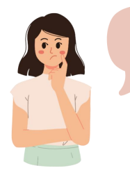

of human competence?

 *Experiment paraphrasing:* Read the following sentences, and 

paraphrase them using the teacher's suggested words.

Activity 1.12 Original text: 
Teacher: 

What's more intelligent: a computer program that can only play chess or one that can only play Go? There's no sensible answer to this, since they're good at different things that can't be directly compared. It also makes little sense to quibble about whether something is or isn't intelligent in borderline cases, since ability comes on a spectrum and isn't necessarily an all-or-nothing trait. Paraphrase: Tegmark (2017) suggests that it is ______________ to _________________________ the _____________________ levels of _______________________________________________ because / on the grounds that / __________________ 
- not sensible (adj.)
- intelligence levels
- different animals 
- because / on the grounds that
- vary in degrees 
(verb)
- isn't an either-or 
(adj.)
Teacher: 
Original text: The conventional wisdom among artificial intelligence researchers is that intelligence is ultimately all about information and computation, not about flesh, blood or carbon atoms. 

But what are information and computation really, given that physics has taught us that, at a fundamental level, everything is simply and energy moving around? How can something as abstract, intangible and ethereal as information and computation be embodied by tangible physical stuff? In particular, how can a bunch of dumb particles moving around according to the laws of physics exhibit behaviour that we'd call intelligent?

We like these sentences because they point to the crux of the issue: Is intelligence computation or neural firings in our brains. We like these sentences because they dispel the all-or-nothing nature of intelligence and express it well, although being a little informal.

Paraphrase:
As Tegmark (2017) _____________________________ that information and computation are like __________________________________________________________. How can such__________________________________manifest______________________ ___________________________ refer to as 'intelligence'?

- question (verb)

 - abstract and ethereal (adj.) 
matters
- be realised as 
- manifest the capacities
- that we refer to as

## What Have You Learnt?

Even the genre called 'academic English' exhibits a wide 

 range of writing styles. Some authors prefer more succinct expression, while others adopt a more conversational style. Observe these variations as you progress through your 4year programme.

 *Evaluating and chunking sentences:* The following are some complex sentences 

expressing complex meanings. Together with your teacher, identify some more sentences from your readings and parse them.

## A Is B, Particularly, C, Wh- D

Following the example, please highlight the different parts in different colours.

AI is becoming a buzzword in many contexts around the world, in particular, in schools and higher institutions, where teaching and learning are increasingly digitized.

E.g.

It perhaps should be stressed again here that students should declare their how much they like fashion, particularly in this assignment, where the focus is on personal critical reflection.

1 2 The 'modern society' concept is in a state of flux, particularly in the last two years, when people are going to transition to a truly sustainable lifestyle. (Write a sentence with your peers.)
3

# "At The Heart Of": Getting Closer To Your Focus

Following this example, highlight the words that show you are getting closer AI approaches are not without (to emphasise there are) controversies and remain a contested territory of ethical consideration. At the heart of these contestations lies a critical question - (a dash is used to explain) will super AI systems ever take over human intelligence (Peeters et al., 2021).

E.g.

1 To a certain extent, glass can be reheated and reworked, but not without challenge. At the core of the skill is overheating the class to cause it to lose its shininess.

2 The artwork market is not without its critiques. At the heart of all great artwork is an idea - a unique concept which drives the artist to explore and delve into new territories. (Write a sentence with your peers.)
3

# The Benefits Of Using Quotes

Quotes are used to emphasise a point or *to express something through the mouth of someone else*. Acquiring this skill is important for your future studies.

An important quote for this literature review (Do not start with he/she says) is that of Harari (2017, p. 251): 
E.g.

"Until today, high intelligence always went hand in hand with a developed consciousness. Only conscious beings could perform tasks that required a lot of intelligence". 

(This is a block quote, and in fact, your opinion. Using someone else's words makes it more credible and fairer.) Next, I examine culture, noting that there are a multitude of conceptions and definitions of that concept. Culture is "an encounter in an open landscape," as Tornberg (2000, p. 284) puts it.

1
(Is a whole sentence quoted here? What do you need to put when you insert a quote?) In reply to this question, James (1976) suggested that *when the object of thought* becomes part of conscious thought, it has been selected out of the stream of pure experience and is now a different, unique, and personal experience of the object:
'To be "conscious" means to have awareness of one's being added to that being; and this is just what happens when appropriative experience supervenes.' (p. 64)
(This is another block quote. What do you do with the quote? Do you just leave it there for your teacher to read?)
2
(Look for another quote and put it here.)

 UEII emphasises language editing skills, so what are your thoughts on writing poor sentences in literature reviews? Please listen to this phone-in program featuring callers discussing their concerns about bad grammar.

Listen to this Radio Programme about bad grammar and careless language usage.

Be a caller. Tell the radio host what makes you 

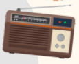 afraid of academic writing.

So I've been asking about bad grammar. Does it wind you up? Now, let me tell you more about the story. This is in the mail this morning, but it's based on some research from University of Birmingham. So bad grammar is so annoying that it activates the fight or flight response within the human body according to this new research. So I'd like to know - we've had a few examples already. 

 What kind of bad grammar? What is it? Does it wind you up to the point? I mean I do notice it. So this is the report it says experts have discovered it really does cause a physical reaction, and even affects our heart rate. Instances of bad grammar include mixing up tenses within the sentence, confusing the singular and plural, using a double negative, or misusing a comma. Researchers from University of Birmingham recruited British English-speaking adults who listened to 40 English speech examples. So this is actually spoken grammar, half of which contained grammatical errors.

What is the host's attitude 

 towards bad grammar?

Caller One (first example) (lady) Hi, morning. Morning. Yes, it's true, when I do hear bad Grammar it makes me wince, but I usually have to control myself not to correct people, because that might sound a bit rude. Anyway, I have two examples. The first one is when people use the word 'invite', which is a verb as a noun, for example, 'Oh, I got an invite to the wedding.' instead of 'I got an invitation to the wedding'. But nobody says invitation anymore. Everybody says I got an 'invite' to…

Does caller one seem relaxed or 

 tense? What is her attitude?

Caller One (second example) The second one is the death of Present Continuous, which for example, 'I was stood at the station' instead of 'I was standing at the station'. What did you call that? The death of the Present Continuous. I like it. Tenses, now we're getting deep into grammar with tenses. Everybody says 'I was stood'. I said 'No, you weren't stood' - 'you were standing'. I was standing at the station. Yes. But everybody says 'I was stood'. (*Host:* I wouldn't say 'I was stood' but some people would. Is that maybe that is a dialect thing as well of…? I can imagine certain dialects would say 'I was stood at the station'. And that might be an excuse for that.)

Questions:

What was the first grammar problem the caller observed? What was the second grammar problem? Be a caller. Express your viewpoints to the radio host.

Starter phrases: "Hello, this is [Your Name], and I'd like to share my perspective on how to write sentences for literature reviews. I work in [Your Discipline], and here's what I've been observing..."

# Low Do You Use The Language Editing Book?

1. Make use of the Language Editing book to learn about the common errors made by past students. If needed, seek clarification from your class teacher. However, do not expect the teacher to drill the items before your tests.

2. Ask yourself: What is the problem here? Why the changed parts are more effective?

3.  The Language editing book suggests certain ways to correct errors, but in actuality, there are many ways to express a message.

| najor plant processes of the          |                                     |                                           |
|---------------------------------------|-------------------------------------|-------------------------------------------|
| Cohesion:                             | salt stress, including              |                                           |
| Citation                              | synthesis and plant nutrition       |                                           |
| can be negatively affected by         |                                     |                                           |
| nigh salinity (Safdar et al.          |                                     |                                           |
| 19). (overuse/unnecess                |                                     |                                           |
| tition of citations) Plant grow       |                                     |                                           |
| productivity could be limited         |                                     |                                           |
| ossibly lead to (what is the          |                                     |                                           |
| ect? What leads to what?!             |                                     |                                           |
| th (Safdar et al., 2019)              |                                     |                                           |
| de & Bahli, 2005 ( citation )         |                                     |                                           |
| problem) suggest that students        |                                     |                                           |
| who are able to attain a state of     |                                     |                                           |
| Citation;                             | immersion (unclear meaning)         |                                           |
| Word choice                           | when utilizing an e-learning system | to fully optimize it to interact with oth |
| are more likely to use it efficiently |                                     |                                           |
| (how to2).                            |                                     |                                           |

## Habits Of Mind…

Remember that your teacher cannot read the

Gateway units page by page with you. Theoretical Literature Reviews involve your on exploration of readings and ideas.

Activity 1.15
 
Please dedicate 30 minutes to writing your sentences in class each week and invite critique from your teachers and classmates. Writing is an open process, so be open to receiving feedback.

Use a OneDrive Document or a Google document to get started with 

 writing. Avoid procrastinating untill the last day. Suggested writing goals
- Craft a Purpose Statement
- Write the first paragraph of your Literature Review (Give a landscape of the topic you are going to investigate).

Get into the OneDrive Document or Google Document which is provided by your teacher. Bookmark this link for later writing activities.

| Student's names                           | Beginning sentence   | Purpose Statement   | Introducing a  theme   |
|-------------------------------------------|----------------------|---------------------|------------------------|
| (Use a prepositional  phrase)             |                      |                     |                        |
| Jamie Leung Peter Wong Lucia Fung … … … … |                      |                     |                        |

# Submit This Plan On Moodle By 16 February 11:59Pm

Second

theme
(sub-heading)
First theme 
(sub-heading)
Third theme
(sub-heading)
Examples, reasons, scholars' view that illustrate the concepts:

You can *cite real-life* examples 

1. BuVatar (AIpowered 

digital avatar with customisable appearances and behaviours) About the project 2. Real-time robotic system About the project The purpose statement?

You cannot know everything. What concepts do you have to research via the library or Google?

# Research Your Topic

1. Brainstorm keywords for your topics before you search for articles online. 2. Use the library databases such as ProQuest to search for relevant articles. 3. Choose 5 suitable articles for your literature review. 4. Fill in the table below.

Title of your Literature Review: 

| Title of article   | Author(s)                   | Book chapter/ article?   | Year   | Why do I need  this?   |
|--------------------|-----------------------------|--------------------------|--------|------------------------|
| 1                  | I can identify  theme _____ |                          |        |                        |
| 2                  | PAGE 63                     |                          |        |                        |

 Choose one topic for your Theoretical Literature Review.

In Gateway 1, we learn about human intelligence and its evolution. If you intend to write about these concepts, please select one of the following topics. If other concepts interest you, consult your teacher and seek approval.

1. Evolution of human intelligence (e.g., ancient 

human species to modern humans; cognitive abilities)

2. Cyborg or human-machine collaboration 3. Artificial creativity
(Example title: 'A literature Review on the evolution of human intelligence in the digital age')

Simple ways to start your research:
- https://library.hkbu.edu.hk/
- https://www.hkpl.gov.hk/tc/index.html
- https://scholar.google.com/

| What you can expect after choosing a topic: Step 1 Choose one topic for your review of the literature. Browse the reading materials folder to find anything useful. Go beyond  Step 2 the folder to look for articles and books on One Search of the library. Concretise the title of the literature review. Read the materials. Look for major themes and concepts you want to  introduce to fellow classmates during your Panel Discussion. Consensus, an AI tool, powered by HKBU library, can help you look up  Step 3 terms and concepts: https://library.hkbu.edu.hk/services/researchsupport/consensus/ Step 4 Prepare for the Panel Discussion (10%). Your pronunciation is assessed. Present your writing plan to your teacher. Concretise your title and Step 5 writing plan. Upload it to Moodle for record (not to be graded). Join in-class writing activity to get started with writing. Do not  Step 6 procrastinate. Download the Literature Review Draft template. Submit your  Step 7 assignment using this template. Ensure your reference list is neat and in APA (American Psychological  Step 8 Association) format. Endnote can help you with this: https://library.hkbu.edu.hk/services/research-support/endnote/ Step 9 Meet your teacher to receive feedback when marking is finished.   |
|---|

