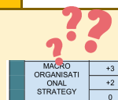
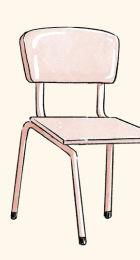

## Your Turn:

Now is the time for you to evaluate these paragraphs using

the assessment rubrics. Read the rubrics and each paragraph. Give a mark to it.

CONTENT
(Includes Academic Evaluation)
(20%)

| Explanations are     | Explanations are   | Explanations are   | Explanations   | Concepts are    |       |    |    |      |    |      |
|----------------------|--------------------|--------------------|----------------|-----------------|-------|----|----|------|----|------|
| highly irrelevant    | somewhat           | moderately         | dsplays a      | explained in    |       |    |    |      |    |      |
| and/or vague         | irrelevant and/or  | relevant and clear | high level of  | context and to  |       |    |    |      |    |      |
| Minimal content      | vague              | Information is     | clarity and    | adequate depth  |       |    |    |      |    |      |
| provided             | Superficial,       | presented but not  | cherence       | of detail       |       |    |    |      |    |      |
| Lacking evaluation   | unresearched       | entirely unpacked  | Makes effort   | Explains jargon |       |    |    |      |    |      |
| and generalisation   | content;           | for readers        | to explain     | with great      |       |    |    |      |    |      |
| of information       | Information is not | A moderate ability | accuracy to    |                 |       |    |    |      |    |      |
| jargon to            |                    |                    |                |                 |       |    |    |      |    |      |
| upacked for          | to evaluate and    | demonstrate        | demonstrate    |                 |       |    |    |      |    |      |
| readers              | gneralise          | reader             | reader         |                 |       |    |    |      |    |      |
| A weak ability to    | awareness          |                    |                |                 |       |    |    |      |    |      |
| information          | awareness          |                    |                |                 |       |    |    |      |    |      |
| evaluate and         | Quite              | Strong ability to  |                |                 |       |    |    |      |    |      |
| generalise           | effective          | evaluate and       |                |                 |       |    |    |      |    |      |
| information          | evaluation         | generalise         |                |                 |       |    |    |      |    |      |
| information          |                    |                    |                |                 |       |    |    |      |    |      |
| and                  |                    |                    |                |                 |       |    |    |      |    |      |
| generalisation       |                    |                    |                |                 |       |    |    |      |    |      |
| n of                 |                    |                    |                |                 |       |    |    |      |    |      |
| information          |                    |                    |                |                 |       |    |    |      |    |      |
| Reader struggles to  | Reader             | Reader             | Reader         | Reader feels    |       |    |    |      |    |      |
| uderstand the        | understands 30-    | uderstands 50-     | understands    | they learnt     |       |    |    |      |    |      |
| something new        |                    |                    |                |                 |       |    |    |      |    |      |
| content all the time | 50%                | 70%                | 70-80%         |                 |       |    |    |      |    |      |
| 10                   | 1.5                | 13.5               | 16             | 16.5            | 17-18 |    |    |      |    |      |
| g                    | 9.5                | 10.5               | 11             | 12              | 12.5  | 13 | 14 | 14.5 | 15 | 15.5 |

What is your comment?

The idea of AI creativity is challenged when the notion of consciousness comes into the picture. Consciousness, a topic debated across many disciplines, including brain science, and even ancient philosophers (Sattin et al., 2021), is hard to define or understand, despite its being present in biological beings, and particularly humans with larger brains (Shear, 1997). The aim of AI, particularly strong or super AI, is to create an independent, non-biological intelligence that incorporates consciousness. However, achieving this, especially without a clear understanding or agreed definition of consciousness, seems quite difficult (Li et al., 2021). The literature reviewed questions what remains of intelligence when it is intelligence without consciousness.

6

| Excellent ability   |    |     |
|---------------------|----|-----|
| to cite different   |    |     |
| types               |    |     |
| information         |    |     |
| different citation  |    |     |
| formats             |    |     |
| Highly effective    |    |     |
| use                 | of | 4-8 |
| sources.            |    |     |

| 17-18   |      |
|---------|------|
| 16      | 16.5 |

What is your comment?

## Yet, More Problems Are Waiting To Be Solved

An important quote from Harari (2017, p. 251) states:
"Until today, high intelligence always went hand in hand with a developed consciousness. Only conscious beings could perform tasks that required a lot of intelligence".

This perspective is at odds with the new definitions of
"creativity" and "consciousness" outlined above that AI
creativity underpins. According to Tegmark (2017), this is Life 3.0, where non-biological intelligent life can think, create and be fully autonomous, existing on an equivalent level with biological life.

| Themes not            | Themes are         | Themes are          | Themes        |      |    |      |    |      |    |      |    |      |
|-----------------------|--------------------|---------------------|---------------|------|----|------|----|------|----|------|----|------|
| identified            | poorly organised   | structured in a     | exhibit an    |      |    |      |    |      |    |      |    |      |
| Unplanned or          | and do not follow  | satisfactory        | avanced       |      |    |      |    |      |    |      |    |      |
| erratic flow of logic | a logical          | manner,             | level of      |      |    |      |    |      |    |      |    |      |
| Generally             | progression        | progressing from    | organization; |      |    |      |    |      |    |      |    |      |
| incoherent            | Digressions and    | general to specific | they are      |      |    |      |    |      |    |      |    |      |
| disjointed            | and from one point | effectively         |               |      |    |      |    |      |    |      |    |      |
| discussions           | to the next.       | introduced          |               |      |    |      |    |      |    |      |    |      |
| 9.5                   | 10                 | 10.5                | 1             | 11.5 | 12 | 12.5 | 13 | 13.5 | 14 | 14.5 | 15 | 15.5 |

| Themes are     |
|----------------|
| presented with |
| excellent      |
| organisation,  |
| leading to     |
| focused        |
| discussions.   |

17-18 16

| 16.5   |
|--------|

What is your comment?

8 By revisiting these notions, my literature review has led to a better understanding of how AI intelligence differs from our traditional understanding of intelligence. However, there is also a risk of disruption to what is considered to be a 'normal' learning process: As AI becomes more human-like, teachers' role in influencing student creativity may shift as the machine becomes creative (see, Creely, 2022), and this could subvert the usual role of a teacher.

The next part of this review will move onto how intelligent machines impact my research area, Physical Activity and Sports.

Overall, does this literature deserve bonus marks?

| MACRO      | Nuanced understanding of the topic / theories at the text level; the work resembles an authentic literature review.   |                                                                                              |
|------------|-----------------------------------------------------------------------------------------------------------------------|----------------------------------------------------------------------------------------------|
| +3         |                                                                                                                       |                                                                                              |
| ORGANISATI |                                                                                                                       |                                                                                              |
| ONAL       | +2                                                                                                                    | Proper framing through selecting and sequencing information, and highlighting of information |
| STRATEGY   | 0                                                                                                                     | No evident macro-organisational strategy use                                                 |

| What do we learn from this literature review? Use discourse organisers Show your understanding                                                                             | Show your evaluation                                                                                   |                                                                |                       |
|----------------------------------------------------------------------------------------------------------------------------------------------------------------------------|--------------------------------------------------------------------------------------------------------|----------------------------------------------------------------|-----------------------|
| to manage the flow of the  discussion                                                                                                                                      | The literature reviewed                                                                                |                                                                |                       |
| -                                                                                                                                                                          | The question of [something] is  emerging                                                               |                                                                |                       |
| -                                                                                                                                                                          | The field of [something] has  evolved                                                                  |                                                                |                       |
| -                                                                                                                                                                          | In general                                                                                             |                                                                |                       |
| -                                                                                                                                                                          | However, with AI, there is an  underlying assumption that                                              |                                                                |                       |
| -                                                                                                                                                                          | …this could subvert the usual  role of a teacher                                                       | questions what remains of                                      |                       |
| -                                                                                                                                                                          | The purpose of this literature  review                                                                 |                                                                |                       |
| -                                                                                                                                                                          | in particular                                                                                          |                                                                |                       |
| -                                                                                                                                                                          | At the same time                                                                                       |                                                                |                       |
| -                                                                                                                                                                          | I would like to introduce two  prominent threads…                                                      |                                                                |                       |
| -                                                                                                                                                                          | By revisiting these notions, my  literature review has led to                                          | intelligence when it is  'intelligence without  consciousness' |                       |
| Use topic sentences                                                                                                                                                        | Show the reader the 'point'                                                                            | Use concept labels                                             |                       |
| by generalising it                                                                                                                                                         |                                                                                                        |                                                                |                       |
| -                                                                                                                                                                          | AI approaches, while innovative,  are not exempt from ethical  controversies.                          |                                                                |                       |
| -                                                                                                                                                                          | However, neither being new nor effective alone is sufficient for AI  to be referred to as intelligent. | -                                                              | The term intelligence |
| -                                                                                                                                                                          | The idea of AI creativity                                                                              |                                                                |                       |
| -                                                                                                                                                                          | Human-centric perspective  (=everything is centred  around humans)                                     |                                                                |                       |
| -                                                                                                                                                                          | The conception of  consciousness                                                                       |                                                                |                       |
| At the heart of these                                                                                                                                                      |                                                                                                        |                                                                |                       |
| contestations lies a critical  question                                                                                                                                    |                                                                                                        |                                                                |                       |
| Sternberg's theory emphasises  that…to perceive the world  through senses and sensibilities                                                                                |                                                                                                        |                                                                |                       |
| Citations                                                                                                                                                                  | Discover with                                                                                          |                                                                |                       |
| Let others speak for you                                                                                                                                                   | your teacher                                                                                           |                                                                |                       |
| Show what is argued in the  field This perspective is at odds with the new definitions of 'creativity'  and 'consciousness' outlined  above that AI creativity  underpins. |                                                                                                        |                                                                |                       |
| AI has been applied to a dozen  industries, including… (Boden  2018; Mitchell 2019; Verma et al.  2021; Yi & Loia 2019).                                                   |                                                                                                        |                                                                |                       |

 In UEI, you learned how to write *Thesis Statements* to introduce your 

arguments. However, in UEII, you should use *Purpose Statements* to introduce the purpose of your theoretical literature review.

Activity 1.7

| Thesis Statements            | …                                                           | Purpose Statements           |
|------------------------------|-------------------------------------------------------------|------------------------------|
| This argumentative essay     | This literature review                                      | This literature review will  |
| posits that the design of    | argumentative essay posits                                  | examine the claim that the   |
| certain platforms is         | that will examine the claim                                 | design of certain platforms  |
| ultimately financially                              | that the design of certain                                  | is financially-driven, and   |
| driven, and thus their       | platforms is ultimately                                     | their primary function is to |
| primary function is to       | financially-driven, and thus                                | manipulate users in order to |
| manipulate users in order to | their primary function is to                                | increase companies' profits. |
| increase companies' profits. | manipulate users in order  to increase companies'  profits. |                              |
| Teacher's comment:           |                                                             |                              |

The Thesis Statement is written in a more definitive and *critical tone*. In a literature review, the tone does not need to be that strong.

Suggestions:
- Use 'examine the claim that' or 'explore the theory that' to focus on the process and the unknown outcome.

- *Delete language that suggests causation*, e.g., 'ultimately' and 'thus'

| -                          | Delete language that suggests causation, e.g., 'ultimately' and 'thus'   |                                |
|----------------------------|--------------------------------------------------------------------------|--------------------------------|
| Social media platforms     | This literature review aims                                              | This literature review aims    |
| should enhance their       | to explore the argument                                                  | to explore the argument        |
| transparency about how     | that social media platforms                                              | that social media platforms    |
| their algorithms influence | ought to should enhance                                                  | ought to enhance their         |
| user behaviour, as this    | their transparency                                                       | transparency regarding the     |
| could promote user         | regarding about how the                                                  | way in which their             |
| empowerment, foster        | way in which their                                                       | algorithms will influence      |
| accountability and ethical | algorithms will influence                                                | user behaviour.                |
| practices, and build trust | user behaviour. It will                                                  |                                |
| between social media       | critically analyse the                                                   | It will critically analyse the |
| platforms and their users. | existing literature to explore                                           | existing literature to explore |

how this such transparency will promote user empowerment, foster accountability and ethical practices, and build trust between social media platforms and their users.

how such transparency will promote user empowerment, 

| promote user empowerment,  foster accountability and  ethical practices, and build  trust between social media  platforms and their users.   |
|----------------------------------------------------------------------------------------------------------------------------------------------|

Teacher's comment:
The Thesis Statement is written in a more definitive tone. In a literature review, the tone does not need to be that strong.

Suggestions:
- Use 'aims to explore' to focus on the process. Use 'regarding the way in which' to focus on the process but not the outcome.

- *Delete language that suggests causation*, e.g., 'as' This literature review This essay argues that the roles of user agency and responsibility, complexity of mental health factors, and individual user differences make it unreasonable to hold social media platforms accountable for mental health issues experienced by 

| users.   |
|----------|

Ask your partner to evaluate your revised sentences:
Where do *you include your purpose?*
- The beginning paragraph should include your *purpose statement*.

- Appropriate headings and subheadings are needed to orientate the reader.

 *Improving the writing of a paragraph:* Writing can never be 'too perfect'. This 

paragraph is drawn from the literature review you already read. Read it again. Discuss with your classmates how you want to improve the writing.

Activity 1.8 When writing a literature review, explain something because the readers need to know it, not because you want to. Keep in mind that your writing can always be *further refined*.

Am I too self-centred in saying my review has 'led to a better understanding'?

By revisiting these notions, my literature review has led to a better understanding of how AI 
intelligence differ from our traditional understanding of intelligence. However, there is also a risk of disruption to what is considered to be a 'normal' learning process: As AI becomes more human-like, teachers' role in influencing student creativity may shift as the machine becomes creative (see, Creely, 2022), and this could further subvert the usual role of a teacher. 

The next part of this review will move onto how intelligent machines impact my research area, Physical Activity and Sports.

Is there a missing 's'?

The last paragraph is further refined: By revisiting these definitions, my literature review has contributed to a more fine-grained led to a better understanding of how AI intelligence differ from our traditional conception understanding of intelligence. However, The wider implication of this discussion is that there is also a risk of disruption to what is considered to be a 'normal' learning process: As AI becomes more human-like, teachers' role in influencing student creativity may shift as the machine becomes creative (see, Creely, 2022), and this development could further subvert the usual role of a teacher.

Sharpen the focus What do the words 'contributed to a more fine-grained understanding', 
'the wider implication' imply?

Why do we need to add 
'development'?

Answer:

 *Speaking:* This activity continues to focus on Intelligence. Below are quotes from 

a book. Read these sentences aloud with emotion and appropriate intonation.

Activity 1.9

| Use a playfully  assertive tone  (Keep smiling)   |                |                |
|---------------------------------------------------|----------------|----------------|
| Use contrastive                                   | Use a warm and | Use a firm and |
| stress patterns                                   | inviting tone  | decisive tone  |

| Student 1                                                                                                                                                                                                            | Student 2                                                                                                                                                                                                                                                     |
|----------------------------------------------------------------------------------------------------------------------------------------------------------------------------------------------------------------------|---------------------------------------------------------------------------------------------------------------------------------------------------------------------------------------------------------------------------------------------------------------|
| Source: Tegmark (2017) Name of Book: Life 3.0                                                                                                                                                                        |                                                                                                                                                                                                                                                               |
| Use contrastive  stress to read out  the contrasting  points.                                                                                                                                                        | Who is a better speaker?                                                                                                                                                                                                                                      |
| So there is clearly NO                                                                                                                                                                                               | UNDISPUTED                                                                                                                                                                                                                                                    |
| 'correct' definition of intelligence.  INSTEAD, there are MANY competing  ones, including capacity for logic,  understanding, emotional knowledge,  self-awareness, creativity, problem  solving and learning. |                                                                                                                                                                                                                                                               |
| Use a warm and  inviting tone. Keep  smiling.                                                                                                                                                                        | In our exploration of the future of  intelligence, we want to take a  MAXIMALLY brroooaad and inclusive  view, not limited to the sorts of  intelligence that exist so far. That's why  the definition I give in the last chapter is  very brroooaad. PAGE 42 |

| Use a firm and                                                                                                                                                                                                                                                                             | Because                                                                                                                                                                                                                 | there        | are           | many   | possible   |
|--------------------------------------------------------------------------------------------------------------------------------------------------------------------------------------------------------------------------------------------------------------------------------------------|-------------------------------------------------------------------------------------------------------------------------------------------------------------------------------------------------------------------------|--------------|---------------|--------|-------------|
| decisive tone                                                                                                                                                                                                                                                                              | goals, there are many possible types of intelligence. By our definition, it  therefore MAKES NO SENSE to quantify intelligence of humans, non—human  animals or machines by a SINGLE  NUMBER [pause] such as an IQ.' |              |               |        |             |
| Use contrastive                                                                                                                                                                                                                                                                            | To classify different intelligences into a                                                                                                                                                                              |              |               |        |             |
| stress patterns                                                                                                                                                                                                                                                                            | taxonomy,                                                                                                                                                                                                               | another      | CRUCIAL       |        |             |
| DISTINCTION [slowly] is that between  NARROW and BROAD intelligence.                                                                                                                                                                                                                      |                                                                                                                                                                                                                         |              |               |        |             |
| Use a firm and                                                                                                                                                                                                                                                                             | Although the word 'intelligence' tends to                                                                                                                                                                               |              |               |        |             |
| decisive tone                                                                                                                                                                                                                                                                              | have                                                                                                                                                                                                                    | positive     | connotations, | it     | is          |
| important to note that we are using it  in a COMPLETELY neutral way: as ability  to accomplish complex goals [pause]  REGARDLESS of whether these goals are  considered good or bad.  Thus, an intelligent person may be very  GOOOOD at HELPING PEOPLE or very  good at HURTING PEOPLE. |                                                                                                                                                                                                                         |              |               |        |             |
| Use a playfully                                                                                                                                                                                                                                                                            | The                                                                                                                                                                                                                     | conventional | wisdom        | among  |             |
| assertive tone                                                                                                                                                                                                                                                                             | artificial intelligence researchers is that  intelligence is ULTIMATELY all about  information and computation, NOT  ABOUT flesh, blood or carbon  atoms. PAGE 43                                                    |              |               |        |             |

This means that there's NO 

 FUNDAMENTAL REASON *[slowly] why* machines can't one day be at least as intelligent as us.

## Academic Evaluations

Academic evaluations typically come in many different forms, not only by using words like 'argue' or 'I argue that'. While reading the material in Part I of UEII, keep these points in mind.

Please ensure that the following words are spoken clearly in your speaking assessments. Speak these words with your partner, making sure each syllable is articulated correctly.

| 1 st                                                | 2 nd     | 3 rd     | 4 th     | 5 th     | 6 th     |    |
|-----------------------------------------------------|----------|----------|----------|----------|----------|----|
| syllable                                            | syllable | syllable | syllable | syllable | syllable |    |
| Words with 5 to 6 syllables Technological futurism  |         |         |         |         |         |   |
| Anthropological research                            |         |         |         |         |         |   |
| Extend capabilities                                 |         |         |         |         |         |    |
| Words with 4 syllables Creative intelligence        |         |         |         |         |          |    |
| Conventional wisdom                                 |         |         |         |         |          |    |
| Complex computation                                 |         |         |         |         |          |    |
| Write creatively                                    |         |         |         |         |          |    |
| Intangible evidence                                 |         |         |         |         |          |    |
| Ultimately all about…                               |         |         |         |         |          |    |
| Maximally broad…                                    |         |         |         |         |          |    |
| Ethereal (light) quality                            |         |         |         |         |          |    |
| Intellectual discussion                             |         |         |         |         |          |    |
| Words with 2 to 3 syllables Prosthetic extension of |         |         |         |          |          |    |
| body Accomplish goals                               |         |         |         |          |          |    |
| Quantify results                                    |         |         |         |          |          |    |
| Inclusive community                                 |         |         |         |          |          |    |

| Crucial distinction     |    |    |    |
|-------------------------|-----|-----|-----|
| Borderline experience   |    |    |    |
| Not limited to          |    |    |    |
| Spectrum of ethnicities |    |    |     |

Together with your teacher, identify other words that are difficult to pronounce:
 You have *a panel discussion task in week 4*. The word *panel* assumes that each person is an expert and they discuss ideas in a group. 

Your teacher will arrange for three students to form a panel. Please sit in a *semicircle*. 

 In the actual assessment, you will prepare two terms to explain to your panel members, based on your readings. However, for this classroom activity, your teacher will assign you terms from the list below. You can use AI tools, such as ChatGPT, to help you.

## Concepts For Research

1. What does the concept of 'intelligence' comprise? Does it relate to capacity or processing speed? 

2. Has the human race evolved to be smarter? 

How does our genetic material evolve?

3. What is AI threshold? 4. What are universal machines? 5. What is narrow and broad intelligence? 6. What do you see in Hans Moravec's landscape of human competence?

Narrator begins: 'The true sign of intelligence is not 

 knowledge but imagination.' as Albert Einstein once said. Welcome everyone, today, we're here to discuss a few interesting and thought-provoking topics. Let's get started.

Alternatively: We invite you all to participate, share your thoughts, and ask questions. Let's embark on this intellectual journey together."
Narrator ends: We can rage on with 

 these complex issues, but time forbids, so we must stop. Thank you, panel members.

What do you see in Hans Moravec's landscape 

of human competence?

 *Experiment paraphrasing:* Read the following sentences, and 

paraphrase them using the teacher's suggested words.

Activity 1.12 Original text: 
Teacher: 

What's more intelligent: a computer program that can only play chess or one that can only play Go? There's no sensible answer to this, since they're good at different things that can't be directly compared. It also makes little sense to quibble about whether something is or isn't intelligent in borderline cases, since ability comes on a spectrum and isn't necessarily an all-or-nothing trait. Paraphrase: Tegmark (2017) suggests that it is ______________ to _________________________ the _____________________ levels of _______________________________________________ because / on the grounds that / __________________ 
- not sensible (adj.)
- intelligence levels
- different animals 
- because / on the grounds that
- vary in degrees 
(verb)
- isn't an either-or 
(adj.)
Teacher: 
Original text: The conventional wisdom among artificial intelligence researchers is that intelligence is ultimately all about information and computation, not about flesh, blood or carbon atoms. 

But what are information and computation really, given that physics has taught us that, at a fundamental level, everything is simply and energy moving around? How can something as abstract, intangible and ethereal as information and computation be embodied by tangible physical stuff? In particular, how can a bunch of dumb particles moving around according to the laws of physics exhibit behaviour that we'd call intelligent?

We like these sentences because they point to the crux of the issue: Is intelligence computation or neural firings in our brains. We like these sentences because they dispel the all-or-nothing nature of intelligence and express it well, although being a little informal.

Paraphrase:
As Tegmark (2017) _____________________________ that information and computation are like __________________________________________________________. How can such__________________________________manifest______________________ ___________________________ refer to as 'intelligence'?

- question (verb)

 - abstract and ethereal (adj.) 
matters
- be realised as 
- manifest the capacities
- that we refer to as

## What Have You Learnt?

Even the genre called 'academic English' exhibits a wide 

 range of writing styles. Some authors prefer more succinct expression, while others adopt a more conversational style. Observe these variations as you progress through your 4year programme.

 *Evaluating and chunking sentences:* The following are some complex sentences 

expressing complex meanings. Together with your teacher, identify some more sentences from your readings and parse them.

## A Is B, Particularly, C, Wh- D

Following the example, please highlight the different parts in different colours.

AI is becoming a buzzword in many contexts around the world, in particular, in schools and higher institutions, where teaching and learning are increasingly digitized.

E.g.

It perhaps should be stressed again here that students should declare their how much they like fashion, particularly in this assignment, where the focus is on personal critical reflection.

1 2 The 'modern society' concept is in a state of flux, particularly in the last two years, when people are going to transition to a truly sustainable lifestyle. (Write a sentence with your peers.)
3

# "At The Heart Of": Getting Closer To Your Focus

Following this example, highlight the words that show you are getting closer AI approaches are not without (to emphasise there are) controversies and remain a contested territory of ethical consideration. At the heart of these contestations lies a critical question - (a dash is used to explain) will super AI systems ever take over human intelligence (Peeters et al., 2021).

E.g.

1 To a certain extent, glass can be reheated and reworked, but not without challenge. At the core of the skill is overheating the class to cause it to lose its shininess.

2 The artwork market is not without its critiques. At the heart of all great artwork is an idea - a unique concept which drives the artist to explore and delve into new territories. (Write a sentence with your peers.)
3

# The Benefits Of Using Quotes

Quotes are used to emphasise a point or *to express something through the mouth of someone else*. Acquiring this skill is important for your future studies.

An important quote for this literature review (Do not start with he/she says) is that of Harari (2017, p. 251): 
E.g.

"Until today, high intelligence always went hand in hand with a developed consciousness. Only conscious beings could perform tasks that required a lot of intelligence". 

(This is a block quote, and in fact, your opinion. Using someone else's words makes it more credible and fairer.) Next, I examine culture, noting that there are a multitude of conceptions and definitions of that concept. Culture is "an encounter in an open landscape," as Tornberg (2000, p. 284) puts it.

1
(Is a whole sentence quoted here? What do you need to put when you insert a quote?) In reply to this question, James (1976) suggested that *when the object of thought* becomes part of conscious thought, it has been selected out of the stream of pure experience and is now a different, unique, and personal experience of the object:
'To be "conscious" means to have awareness of one's being added to that being; and this is just what happens when appropriative experience supervenes.' (p. 64)
(This is another block quote. What do you do with the quote? Do you just leave it there for your teacher to read?)
2
(Look for another quote and put it here.)

 UEII emphasises language editing skills, so what are your thoughts on writing poor sentences in literature reviews? Please listen to this phone-in program featuring callers discussing their concerns about bad grammar.

Listen to this Radio Programme about bad grammar and careless language usage.

Be a caller. Tell the radio host what makes you 

 afraid of academic writing.

So I've been asking about bad grammar. Does it wind you up? Now, let me tell you more about the story. This is in the mail this morning, but it's based on some research from University of Birmingham. So bad grammar is so annoying that it activates the fight or flight response within the human body according to this new research. So I'd like to know - we've had a few examples already. 

 What kind of bad grammar? What is it? Does it wind you up to the point? I mean I do notice it. So this is the report it says experts have discovered it really does cause a physical reaction, and even affects our heart rate. Instances of bad grammar include mixing up tenses within the sentence, confusing the singular and plural, using a double negative, or misusing a comma. Researchers from University of Birmingham recruited British English-speaking adults who listened to 40 English speech examples. So this is actually spoken grammar, half of which contained grammatical errors.

What is the host's attitude 

 towards bad grammar?

Caller One (first example) (lady) Hi, morning. Morning. Yes, it's true, when I do hear bad Grammar it makes me wince, but I usually have to control myself not to correct people, because that might sound a bit rude. Anyway, I have two examples. The first one is when people use the word 'invite', which is a verb as a noun, for example, 'Oh, I got an invite to the wedding.' instead of 'I got an invitation to the wedding'. But nobody says invitation anymore. Everybody says I got an 'invite' to…

Does caller one seem relaxed or 

 tense? What is her attitude?

Caller One (second example) The second one is the death of Present Continuous, which for example, 'I was stood at the station' instead of 'I was standing at the station'. What did you call that? The death of the Present Continuous. I like it. Tenses, now we're getting deep into grammar with tenses. Everybody says 'I was stood'. I said 'No, you weren't stood' - 'you were standing'. I was standing at the station. Yes. But everybody says 'I was stood'. (*Host:* I wouldn't say 'I was stood' but some people would. Is that maybe that is a dialect thing as well of…? I can imagine certain dialects would say 'I was stood at the station'. And that might be an excuse for that.)

Questions:

What was the first grammar problem the caller observed? What was the second grammar problem? Be a caller. Express your viewpoints to the radio host.

Starter phrases: "Hello, this is [Your Name], and I'd like to share my perspective on how to write sentences for literature reviews. I work in [Your Discipline], and here's what I've been observing..."

# Low Do You Use The Language Editing Book?

1. Make use of the Language Editing book to learn about the common errors made by past students. If needed, seek clarification from your class teacher. However, do not expect the teacher to drill the items before your tests.

2. Ask yourself: What is the problem here? Why the changed parts are more effective?

3.  The Language editing book suggests certain ways to correct errors, but in actuality, there are many ways to express a message.

| najor plant processes of the          |                                     |                                           |
|---------------------------------------|-------------------------------------|-------------------------------------------|
| Cohesion:                             | salt stress, including              |                                           |
| Citation                              | synthesis and plant nutrition       |                                           |
| can be negatively affected by         |                                     |                                           |
| nigh salinity (Safdar et al.          |                                     |                                           |
| 19). (overuse/unnecess                |                                     |                                           |
| tition of citations) Plant grow       |                                     |                                           |
| productivity could be limited         |                                     |                                           |
| ossibly lead to (what is the          |                                     |                                           |
| ect? What leads to what?!             |                                     |                                           |
| th (Safdar et al., 2019)              |                                     |                                           |
| de & Bahli, 2005 ( citation )         |                                     |                                           |
| problem) suggest that students        |                                     |                                           |
| who are able to attain a state of     |                                     |                                           |
| Citation;                             | immersion (unclear meaning)         |                                           |
| Word choice                           | when utilizing an e-learning system | to fully optimize it to interact with oth |
| are more likely to use it efficiently |                                     |                                           |
| (how to2).                            |                                     |                                           |

## Habits Of Mind…

Remember that your teacher cannot read the

Gateway units page by page with you. Theoretical Literature Reviews involve your on exploration of readings and ideas.

Activity 1.15
 
Please dedicate 30 minutes to writing your sentences in class each week and invite critique from your teachers and classmates. Writing is an open process, so be open to receiving feedback.

Use a OneDrive Document or a Google document to get started with 

 writing. Avoid procrastinating untill the last day. Suggested writing goals
- Craft a Purpose Statement
- Write the first paragraph of your Literature Review (Give a landscape of the topic you are going to investigate).

Get into the OneDrive Document or Google Document which is provided by your teacher. Bookmark this link for later writing activities.

| Student's names                           | Beginning sentence   | Purpose Statement   | Introducing a  theme   |
|-------------------------------------------|----------------------|---------------------|------------------------|
| (Use a prepositional  phrase)             |                      |                     |                        |
| Jamie Leung Peter Wong Lucia Fung … … … … |                      |                     |                        |

# Submit This Plan On Moodle By 16 February 11:59Pm

Second

theme
(sub-heading)
First theme 
(sub-heading)
Third theme
(sub-heading)
Examples, reasons, scholars' view that illustrate the concepts:

You can *cite real-life* examples 

1. BuVatar (AIpowered 

digital avatar with customisable appearances and behaviours) About the project 2. Real-time robotic system About the project The purpose statement?

You cannot know everything. What concepts do you have to research via the library or Google?

# Research Your Topic

1. Brainstorm keywords for your topics before you search for articles online. 2. Use the library databases such as ProQuest to search for relevant articles. 3. Choose 5 suitable articles for your literature review. 4. Fill in the table below.

Title of your Literature Review: 

| Title of article   | Author(s)                   | Book chapter/ article?   | Year   | Why do I need  this?   |
|--------------------|-----------------------------|--------------------------|--------|------------------------|
| 1                  | I can identify  theme _____ |                          |        |                        |
| 2                  | PAGE 63                     |                          |        |                        |

 Choose one topic for your Theoretical Literature Review.

In Gateway 1, we learn about human intelligence and its evolution. If you intend to write about these concepts, please select one of the following topics. If other concepts interest you, consult your teacher and seek approval.

1. Evolution of human intelligence (e.g., ancient 

human species to modern humans; cognitive abilities)

2. Cyborg or human-machine collaboration 3. Artificial creativity
(Example title: 'A literature Review on the evolution of human intelligence in the digital age')

Simple ways to start your research:
- https://library.hkbu.edu.hk/
- https://www.hkpl.gov.hk/tc/index.html
- https://scholar.google.com/

| What you can expect after choosing a topic: Step 1 Choose one topic for your review of the literature. Browse the reading materials folder to find anything useful. Go beyond  Step 2 the folder to look for articles and books on One Search of the library. Concretise the title of the literature review. Read the materials. Look for major themes and concepts you want to  introduce to fellow classmates during your Panel Discussion. Consensus, an AI tool, powered by HKBU library, can help you look up  Step 3 terms and concepts: https://library.hkbu.edu.hk/services/researchsupport/consensus/ Step 4 Prepare for the Panel Discussion (10%). Your pronunciation is assessed. Present your writing plan to your teacher. Concretise your title and Step 5 writing plan. Upload it to Moodle for record (not to be graded). Join in-class writing activity to get started with writing. Do not  Step 6 procrastinate. Download the Literature Review Draft template. Submit your  Step 7 assignment using this template. Ensure your reference list is neat and in APA (American Psychological  Step 8 Association) format. Endnote can help you with this: https://library.hkbu.edu.hk/services/research-support/endnote/ Step 9 Meet your teacher to receive feedback when marking is finished.   |
|---|

